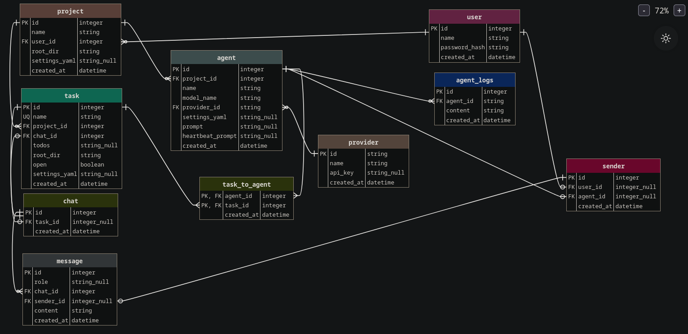

# ERD


# Endpoint plan
Prefix everything with `/api/v0/` if its an api endpoint,

## Project
Suggested Schemas
- ProjectCreate
- ProjectUpdate

| METHODS | ENDPOINT | URL | COMPLETE? | FUNCTIONAL, NONFUNCTIONAL REQ |
|-|-|-|-|-|
| GET | /projects/ | Get all projects for user | N | F |
| GET, PATCH, DELETE | /projects/{userid}/{project_id} | Get project, and project settings, update project, delete project | N | F |
| GET, POST | /projects/{userid}/{project_id}/chat | Get chat, send message (general project chat, use ChatAgent) | N | NF |
| POST | /projects/import | Import a project into sublimate | N | NF |

## Tasks 
Suggested Schemas
- TaskCreate
- TaskUpdate

| METHODS | ENDPOINT | URL | COMPLETE? | FUNCTIONAL, NONFUNCTIONAL REQ |
|-|-|-|-|-|
| GET, POST | /projects/{project_id}/{user_id}/tasks/ | Get tasks, create new task | N | F |
| GET, PATCH, DELETE | /projects/{project_id}/{user_id}/tasks/{task_id} | CRUD, including closing a task | F | F |
| GET, POST | /projects/{project_id}/{user_id}/tasks/{task_id}/chat | Get project chat, send message in project chat | N | F |
| GET, POST | /ws/projects/{project_id}/{user_id}/tasks/{task_id}/chat | Get project chat, send message in project chat, live feedback of project chat | N | NF |

## Providers
Suggested Schemas
- ProviderCreate
- ProviderUpdate 

| METHODS | ENDPOINT | URL | COMPLETE? | FUNCTIONAL, NONFUNCTIONAL REQ |
|-|-|-|-|-|
| GET, POST | /providers/ | Get providers (for the user that created them), set provider | N | F | 
| GET, PATCH, DELTE | /providers/{provider_name} | Get provider, update provider, remove provider | N | F |

## User 
?

| METHODS | ENDPOINT | URL | COMPLETE? | FUNCTIONAL, NONFUNCTIONAL REQ |
|-|-|-|-|-|
| POST | /login | login | N | F |
| GET  | /logout | logout | N | F |
| GET, PATCH | /settings | get settings, update settings | N | NF |


# Functional Features
| FEATURE | IMPLEMENTED |
|-|-|
| Create projects | N |
| Importing projects | N |
| Set remote, add remote, remove remote etc | N |
| Task create, remove | N |
...more

# Non Functional Features
| FEATURE | IMPLEMENTED |
|-|-|
| Multi user systems: create remove update accounts | N |
...more

# Datastorage prototype (to store data generated or in use by sublimate)
```
~/.sublimate/
|-  projects/
    |-  {project_name}.git/ # bare repository
        |-  sublimate/
            |-  {branch_name}
|-  postgres/
```

# Web layout
Coming soon!

