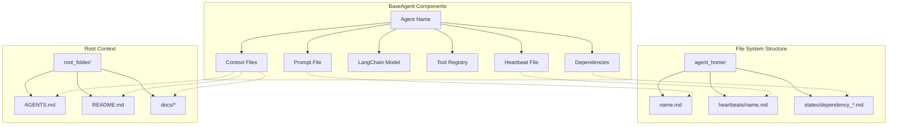
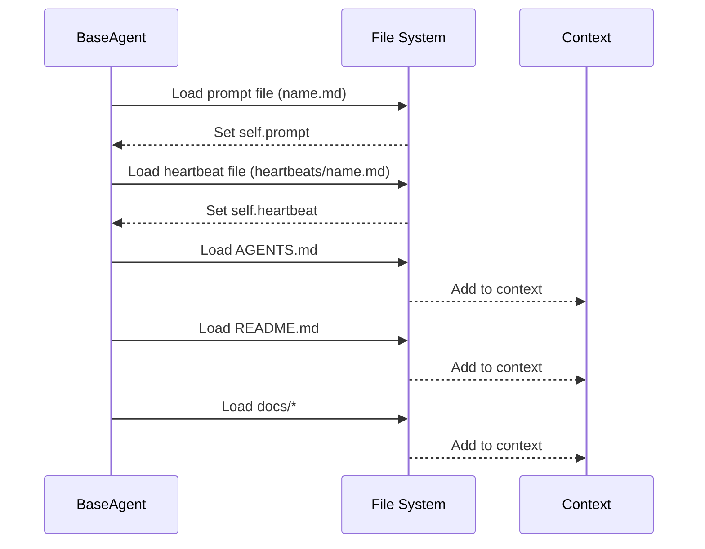
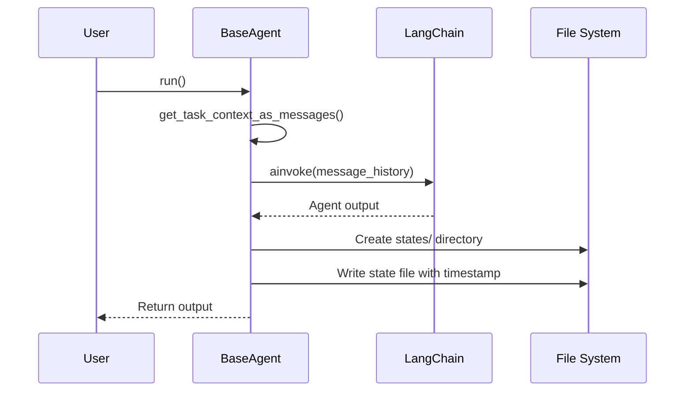

# BaseAgent Class

## Overview

The `BaseAgent` class is the core component of the Sublimate Composer system, representing individual AI agents that can interact with codebases, execute tasks, and collaborate with other agents. Each agent has its own prompt, tools, context, and execution capabilities.

## Class Definition

```python
class BaseAgent:
    def __init__(
        self,
        name: str,
        agent_home,
        model,
        tools=[],
        root_folder="",
    ):
        # Initialization logic
```

## Architecture Diagram



## Core Responsibilities

1. **Agent Initialization**: Load configuration and set up agent identity
2. **Context Management**: Load and manage agent context from files
3. **Message Formatting**: Prepare messages with appropriate context for LLM
4. **Tool Integration**: Provide access to tools for codebase interaction
5. **Dependency Management**: Handle dependencies between agents
6. **Execution**: Invoke agent with task context

## Constructor Parameters

| Parameter | Type | Required | Description |
|-----------|------|----------|-------------|
| `name` | `str` | Yes | Unique identifier for the agent |
| `agent_home` | `str` or `Path` | Yes | Directory containing agent configuration files |
| `model` | LangChain Model | Yes | Language model instance for agent reasoning |
| `tools` | `List` | No | List of tools the agent can use (default: `[]`) |
| `root_folder` | `str` | No | Root directory for context files (default: `""`) |

## Key Attributes

| Attribute | Type | Description |
|-----------|------|-------------|
| `name` | `str` | Agent name identifier |
| `prompt` | `str` | Main agent instructions loaded from prompt file |
| `heartbeat` | `str` | Heartbeat-specific instructions |
| `model` | LangChain Model | Language model instance |
| `context` | `List[Tuple[str, str]]` | List of (filepath, content) pairs for context |
| `agent_home` | `Path` | Path to agent home directory |
| `root_folder` | `Path` | Path to root folder for context |
| `agent_file_paths` | `List[Tuple[str, Path]]` | Paths to agent-specific files |
| `dependencies` | `Set` | Set of dependent agents |
| `get_chat_history` | `Callable` | Function to retrieve chat history |
| `agent` | LangChain Agent | LangChain agent instance with tools |

## File System Requirements

### Required Files
```
agent_home/
├── {name}.md                    # Main agent prompt
└── heartbeats/
    └── {name}.md               # Heartbeat instructions
```

### Optional Context Files
```
root_folder/
├── AGENTS.md                   # Global agent documentation
├── README.md                   # Project documentation
└── ../docs/*                   # Additional documentation
```

### Dependency State Files
```
agent_home/
└── states/
    ├── {dependency1}_*.md     # Dependency state files
    └── {dependency2}_*.md     # Ordered by timestamp
```

## Core Methods

### `load_agent()`

Loads agent prompt, heartbeat, and context files.

**Flow:**


### `format_message_history(message_history, **kwargs)`

Formats message history with agent context for LLM consumption.

**Parameters:**
- `message_history`: List of message dictionaries with `role` and `content`
- `**kwargs`: Boolean flags to control context inclusion:
  - `include_prompt` (default: `True`): Include agent prompt
  - `include_heartbeat` (default: `True`): Include heartbeat instructions
  - `include_context_files` (default: `True`): Include context files
  - `include_dependencies` (default: `True`): Include dependency states

**Returns:** Dictionary with `"messages"` key containing formatted messages

**Example Output Structure:**
```json
{
  "messages": [
    {"role": "system", "content": "Agent prompt content..."},
    {"role": "system", "content": "Heartbeat instructions..."},
    {"role": "system", "content": "AGENTS.md\n```content...```"},
    {"role": "user", "content": "User message..."},
    {"role": "assistant", "content": "Previous response..."}
  ]
}
```

### `invoke(message_history, **kwargs)`

Synchronously invokes the agent with formatted message history.

**Parameters:** Same as `format_message_history`
**Returns:** Agent response from LangChain agent

### `ainvoke(message_history, **kwargs)`

Asynchronously invokes the agent with formatted message history.

**Parameters:** Same as `format_message_history`
**Returns:** Async agent response from LangChain agent

### `add_dependency(agent)`

Adds another agent as a dependency.

**Parameters:** `agent` - Another `BaseAgent` instance
**Returns:** `None` (adds to `self.dependencies` set)

### `run(**kwargs)`

Runs the agent and saves output to a state file (async method).

**Flow:**


## Usage Examples

### Basic Agent Setup

```python
from src.orchestration.composer import BaseAgent
from langchain.chat_models import init_chat_model

# Initialize model
model = init_chat_model(
    model_provider="ollama",
    model="qwen3.5:0.8b"
)

# Create agent
agent = BaseAgent(
    name="coder",
    agent_home="./my_agents",
    model=model,
    tools=[write_file_tool, read_file_tool],
    root_folder="/projects/my_project"
)

# Load agent files
agent.load_agent()

# Invoke agent
response = agent.invoke([
    {"role": "user", "content": "Create a Python function to calculate factorial"}
])
print(response)
```

### Agent with Dependencies

```python
# Create multiple agents
coder = BaseAgent("coder", "./agents", model, [])
tester = BaseAgent("tester", "./agents", model, [])
reviewer = BaseAgent("reviewer", "./agents", model, [])

# Set up dependencies
tester.add_dependency(coder)    # Tester depends on coder
reviewer.add_dependency(tester) # Reviewer depends on tester

# When reviewer runs, it will include states from coder and tester
reviewer.load_agent()
```

### Custom Context Loading

```python
class CustomAgent(BaseAgent):
    def load_agent(self):
        # Call parent implementation
        super().load_agent()

        # Add custom context
        custom_files = [
            self.root_folder / "SPECIFICATION.md",
            self.root_folder / "ARCHITECTURE.md",
            self.root_folder / "CONTRIBUTING.md"
        ]

        self.load_files_for(self.context, custom_files)

        # Add API documentation
        api_docs = glob.glob(str(self.root_folder / "api" / "*.md"))
        self.load_files_for(self.context, api_docs)
```

## Error Handling

### Common Errors

1. **FileNotFoundError**: Raised when required agent files are missing
2. **KeyError**: Raised when accessing undefined attributes
3. **RuntimeError**: Raised when agent dependencies cause circular references

### Error Recovery

```python
try:
    agent = BaseAgent("coder", "./agents", model)
    agent.load_agent()
except FileNotFoundError as e:
    print(f"Missing agent file: {e}")
    # Create default files
    create_default_agent_files("./agents", "coder")
    agent.load_agent()
except Exception as e:
    print(f"Unexpected error: {e}")
    # Log error and fall back to basic agent
    agent = create_basic_agent("coder", model)
```

## Performance Considerations

### Context Management
- **Large Contexts**: Limit context size to avoid token limits
- **Caching**: Consider caching loaded files for repeated invocations
- **Lazy Loading**: Load files only when needed

### Memory Usage
- **Tool Registry**: Tools are shared references, not copied
- **Model Sharing**: Multiple agents can share the same model instance
- **State Files**: Clean up old state files periodically

## Security Considerations

### File Access
- **Path Validation**: Validate all file paths before reading/writing
- **Permission Checks**: Ensure agents only access allowed directories
- **Input Sanitization**: Sanitize file contents before including in context

### Tool Safety
- **Tool Restrictions**: Limit dangerous tools (e.g., shell access)
- **Audit Logging**: Log all tool invocations
- **Resource Limits**: Implement timeouts and memory limits

## Testing Strategies

### Unit Tests
```python
import pytest
from unittest.mock import Mock, patch, MagicMock

def test_agent_initialization():
    """Test agent initialization with minimal parameters"""
    mock_model = Mock()
    agent = BaseAgent("test_agent", "/tmp/agents", mock_model)

    assert agent.name == "test_agent"
    assert agent.agent_home == Path("/tmp/agents")
    assert agent.model == mock_model
    assert agent.tools == []
    assert agent.dependencies == set()

def test_agent_file_loading():
    """Test loading agent files"""
    with tempfile.TemporaryDirectory() as tmpdir:
        # Create agent files
        agent_dir = Path(tmpdir) / "agents"
        agent_dir.mkdir()
        (agent_dir / "heartbeats").mkdir()

        with open(agent_dir / "test.md", "w") as f:
            f.write("# Test Agent Prompt")

        with open(agent_dir / "heartbeats" / "test.md", "w") as f:
            f.write("# Test Heartbeat")

        mock_model = Mock()
        agent = BaseAgent("test", agent_dir, mock_model)
        agent.load_agent()

        assert agent.prompt == "# Test Agent Prompt"
        assert agent.heartbeat == "# Test Heartbeat"
```

### Integration Tests
```python
def test_agent_invocation():
    """Test agent invocation with mocked LangChain"""
    with patch("langchain.agents.create_agent") as mock_create:
        mock_agent = MagicMock()
        mock_agent.invoke.return_value = "Mocked response"
        mock_create.return_value = mock_agent

        mock_model = Mock()
        agent = BaseAgent("test", "/tmp", mock_model)

        response = agent.invoke([
            {"role": "user", "content": "Test message"}
        ])

        assert response == "Mocked response"
        mock_agent.invoke.assert_called_once()
```

## Best Practices

### Agent Design
1. **Single Responsibility**: Each agent should have a clear, focused purpose
2. **Clear Prompts**: Write detailed, unambiguous prompt files
3. **Tool Selection**: Provide only necessary tools for the agent's role
4. **Context Management**: Include relevant but concise context

### File Organization
1. **Structured Directories**: Follow the established directory structure
2. **Version Control**: Keep agent files under version control
3. **Documentation**: Document agent purposes and capabilities
4. **Backup**: Regularly backup agent configurations

### Performance Optimization
1. **Context Pruning**: Remove outdated context files
2. **Caching**: Cache frequently accessed files
3. **Parallel Loading**: Load files in parallel when possible
4. **Lazy Evaluation**: Defer expensive operations until needed

## Extension Points

### Custom Agent Classes
```python
class SpecializedAgent(BaseAgent):
    def __init__(self, *args, specialty=None, **kwargs):
        super().__init__(*args, **kwargs)
        self.specialty = specialty

    def format_message_history(self, message_history, **kwargs):
        # Add specialty to context
        formatted = super().format_message_history(message_history, **kwargs)

        if self.specialty:
            specialty_msg = {
                "role": "system",
                "content": f"Specialty: {self.specialty}"
            }
            formatted["messages"].insert(0, specialty_msg)

        return formatted
```

### Plugin System
```python
class PluginAgent(BaseAgent):
    def __init__(self, *args, plugins=None, **kwargs):
        super().__init__(*args, **kwargs)
        self.plugins = plugins or []

    def invoke(self, message_history, **kwargs):
        # Run pre-invoke plugins
        for plugin in self.plugins:
            message_history = plugin.pre_invoke(self, message_history)

        # Invoke agent
        response = super().invoke(message_history, **kwargs)

        # Run post-invoke plugins
        for plugin in self.plugins:
            response = plugin.post_invoke(self, response)

        return response
```

## Related Documentation

- [BaseTask Documentation](./BaseTask.md)
- [Heartbeat Documentation](./Heartbeat.md)
- [BaseComposer Documentation](./BaseComposer.md)
- [Composer Overview](../composer.md)

## Summary

The `BaseAgent` class provides a robust foundation for creating AI agents that can interact with codebases, use tools, and collaborate with other agents. By following the established patterns and best practices, developers can create specialized agents for various software development tasks while maintaining consistency and reliability across the system.
