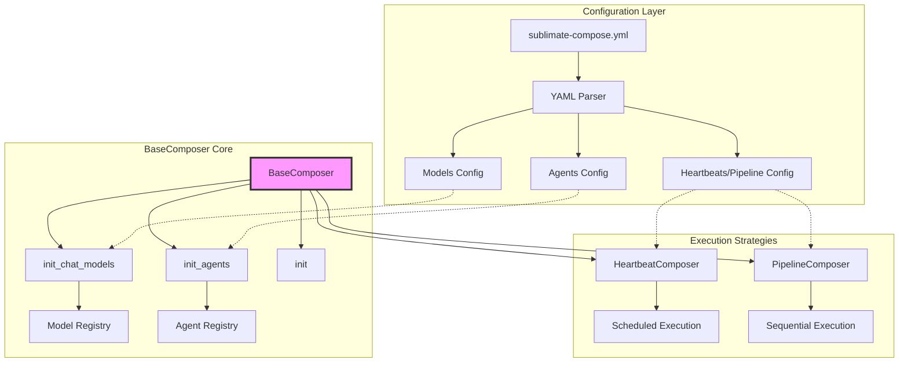
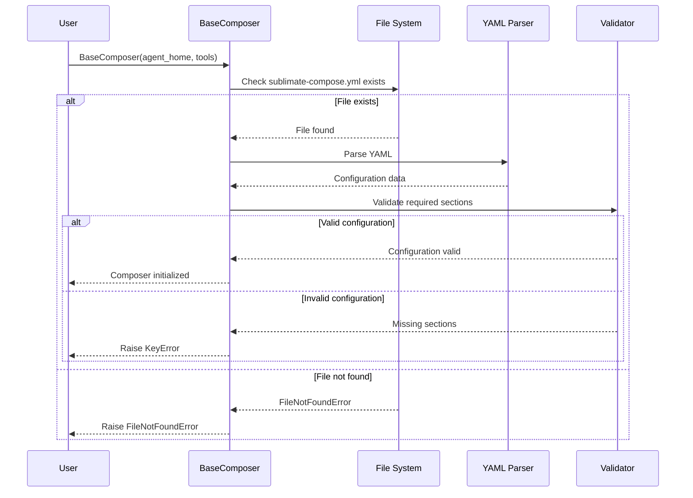

# BaseComposer Class

## Overview

The `BaseComposer` class is the central orchestration engine of the Sublimate Composer system. It manages the initialization, configuration, and coordination of multiple AI agents based on a YAML configuration file (`sublimate-compose.yml`). The composer handles model initialization, agent creation, and provides the foundation for both heartbeat-scheduled and pipeline-based execution.

## Architecture Diagram



## Class Definition

```python
class BaseComposer:
    def __init__(self, agent_home, tools: dict, root_folder=""):
        # Initialization logic
```

## Core Responsibilities

1. **Configuration Loading**: Parse and validate `sublimate-compose.yml`
2. **Model Management**: Initialize and manage LLM model instances
3. **Agent Orchestration**: Create and manage `WorkerAgent` instances
4. **Tool Distribution**: Provide tools to appropriate agents
5. **Lifecycle Management**: Handle initialization and cleanup
6. **Error Handling**: Validate configuration and handle initialization errors

## Constructor Parameters

| Parameter | Type | Required | Description |
|-----------|------|----------|-------------|
| `agent_home` | `str` or `Path` | Yes | Directory containing `sublimate-compose.yml` |
| `tools` | `Dict[str, Callable]` | Yes | Dictionary mapping tool names to functions |
| `root_folder` | `str` | No | Root directory for project context (default: `""`) |

## Key Attributes

| Attribute | Type | Description |
|-----------|------|-------------|
| `agent_home` | `Path` | Path to agent home directory |
| `root_folder` | `Path` | Path to root folder for context |
| `agents` | `Dict[str, WorkerAgent]` | Registry of agent instances |
| `models` | `Dict[str, LangChain Model]` | Registry of model instances |
| `tools` | `Dict[str, Callable]` | Tool registry |
| `data` | `Dict` | Parsed YAML configuration |

## Configuration File Structure

### Required Sections
```yaml
models:
  # Model definitions

agents:
  # Agent definitions

heartbeats:  # OR pipeline:
  # Execution schedule
```

### Complete Example
```yaml
models:
  default-model:
    model_provider: ollama
    model: qwen3.5:0.8b
    temperature: 0.4

  fast-model:
    model_provider: ollama
    model: phi3:mini

agents:
  coder:
    model: default-model
    tools: [write_file, read_file, run_tests]

  reviewer:
    model: fast-model
    tools: [read_file, create_issue]

heartbeats:
  coder:
    schedule: "*/30 * * * *"

  reviewer:
    schedule: "0 * * * *"
    dependencies: [coder]
```

## Core Methods

### `__init__(agent_home, tools, root_folder="")`

Initializes the composer with configuration.

**Flow:**


### `init_chat_models()`

Initializes all chat models from configuration.

**Process:**
1. Iterate through `data["models"]`
2. Call `init_chat_model()` for each model
3. Store models in `self.models` registry

### `init_agents(Agent=WorkerAgent)`

Initializes all agents from configuration.

**Process:**
1. Iterate through `data["agents"]`
2. For each agent:
   - Get model reference from `self.models`
   - Get tools list from configuration
   - Create `WorkerAgent` instance
   - Load agent files
   - Store in `self.agents` registry

### `init()`

Convenience method to initialize both models and agents.

**Equivalent to:**
```python
self.init_chat_models()
self.init_agents()
```

### `get_agent(name)`

Retrieves an agent by name from the registry.

**Parameters:** `name` - Agent name string
**Returns:** `WorkerAgent` instance or `None`

### `schedule_agent(name)`

Gets the agent's run method for scheduling.

**Parameters:** `name` - Agent name string
**Returns:** Agent's `run` method
**Raises:** `KeyError` if agent not found

## Configuration Validation

### Required Sections Check
```python
if not all([
    "models" in self.data.keys(),
    "agents" in self.data.keys(),
    "heartbeats" in self.data.keys() or "pipeline" in self.data.keys(),
]):
    raise KeyError(
        "You need to have: models, agents and either heartbeats OR a pipeline to run compose."
    )
```

### File Existence Check
```python
filepath = self.agent_home / "sublimate-compose.yml"
if not os.path.exists(filepath):
    raise FileNotFoundError(
        f"{filepath} not found! You need a sublimate-compose.yml if you want to use compose."
    )
```

## Usage Examples

### Basic Composer Setup

```python
from src.orchestration.composer import BaseComposer

# Define tools
def write_file(path, content):
    with open(path, 'w') as f:
        f.write(content)
    return f"Written to {path}"

def read_file(path):
    with open(path, 'r') as f:
        return f.read()

tools = {
    'write_file': write_file,
    'read_file': read_file
}

# Initialize composer
composer = BaseComposer(
    agent_home="./my_agents",
    tools=tools,
    root_folder="/projects/my_project"
)

# Initialize models and agents
composer.init()

# Access agents
coder = composer.get_agent("coder")
reviewer = composer.get_agent("reviewer")

# Use agents
response = coder.invoke([
    {"role": "user", "content": "Write a test for the User class"}
])
```

### Error Handling Example

```python
import tempfile
import os

try:
    # Test with missing configuration
    with tempfile.TemporaryDirectory() as tmpdir:
        composer = BaseComposer(tmpdir, {})
except FileNotFoundError as e:
    print(f"Expected error: {e}")
    # Create default configuration
    create_default_config(tmpdir)
    composer = BaseComposer(tmpdir, {})
    composer.init()

try:
    # Test with invalid configuration
    with tempfile.TemporaryDirectory() as tmpdir:
        config_path = os.path.join(tmpdir, "sublimate-compose.yml")
        with open(config_path, 'w') as f:
            f.write("agents: {}")  # Missing models section

        composer = BaseComposer(tmpdir, {})
except KeyError as e:
    print(f"Expected error: {e}")
    # Fix configuration
    fix_configuration(config_path)
```

### Custom Agent Class Integration

```python
from src.orchestration.composer import BaseComposer, WorkerAgent

class SpecializedAgent(WorkerAgent):
    def __init__(self, *args, specialty=None, **kwargs):
        super().__init__(*args, **kwargs)
        self.specialty = specialty

    def load_agent(self):
        super().load_agent()
        # Add specialty to prompt
        if self.specialty:
            self.prompt = f"Specialty: {self.specialty}\n\n{self.prompt}"

# Use custom agent class
composer = BaseComposer("./agents", {})
composer.init_agents(Agent=SpecializedAgent)

# Agents will be created as SpecializedAgent instances
```

## Model Initialization Details

### `init_chat_model(model, model_data)`

Initializes a single chat model with API key handling.

**Process:**
```python
def init_chat_model(self, model, model_data):
    self.models[model] = init_chat_model(
        **model_data,
        api_key=self.fetch_api_key_for_provider(
            model_data.get(
                "model_provider",
                model_data.get("model", ":").split(":")[0],
            )
        ),
    )
```

### API Key Management

```python
def fetch_api_key_for_provider(self, provider: str) -> str:
    # TODO: Implement proper API key retrieval
    # Currently returns dummy key for testing
    return os.environ.get("TEST_API_TOKEN")
```

**Future Implementation:** Database lookup, secret management integration

## Agent Initialization Details

### `init_agent(agent, agent_data, Agent=WorkerAgent)`

Initializes a single agent with tools and model.

**Process:**
```python
def init_agent(self, agent, agent_data, Agent=WorkerAgent):
    self.agents[agent] = Agent(
        agent,
        self.agent_home,
        self.models[
            agent_data.get("model", agent_data.get("model_name", "default"))
        ],
        [
            tool
            for tool in [
                self.tools.get(x, None) for x in agent_data.get("tools", [])
            ]
            if tool
        ],
        str(self.root_folder),
    )

    self.agents[agent].load_agent()
```

## Utility Methods

### `get_heartbeats_from_settings()`
Returns heartbeat configurations from YAML.

### `get_heartbeat_from_settings(name)`
Returns specific heartbeat configuration.

### `get_pipeline_from_settings()`
Returns pipeline configuration from YAML.

### `get_agents()`
Returns all agent instances.

### `get_models()`
Returns all model instances.

### `get_model(name)`
Returns specific model instance.

### `get_agent_names()`
Returns list of agent names from configuration.

## Error Handling Strategies

### Configuration Errors
```python
try:
    composer = BaseComposer(agent_home, tools)
    composer.init()
except FileNotFoundError as e:
    # Handle missing configuration file
    logger.error(f"Configuration file missing: {e}")
    create_default_configuration(agent_home)
    composer = BaseComposer(agent_home, tools)
    composer.init()
except KeyError as e:
    # Handle invalid configuration structure
    logger.error(f"Invalid configuration: {e}")
    validate_and_fix_configuration(agent_home)
    composer = BaseComposer(agent_home, tools)
    composer.init()
except yaml.YAMLError as e:
    # Handle YAML parsing errors
    logger.error(f"YAML parsing error: {e}")
    backup_and_restore_configuration(agent_home)
```

### Runtime Errors
```python
def safe_agent_invocation(composer, agent_name, message):
    """Safely invoke agent with error handling"""
    agent = composer.get_agent(agent_name)
    if not agent:
        raise ValueError(f"Agent {agent_name} not found")

    try:
        return agent.invoke([{"role": "user", "content": message}])
    except Exception as e:
        logger.error(f"Agent invocation failed: {e}")
        # Fallback strategies
        return fallback_response(message)
```

## Performance Considerations

### Lazy Initialization
```python
class LazyBaseComposer(BaseComposer):
    def __init__(self, *args, **kwargs):
        super().__init__(*args, **kwargs)
        self._initialized = False

    def get_agent(self, name):
        if not self._initialized:
            self.init()
            self._initialized = True
        return super().get_agent(name)
```

### Caching Strategies
```python
class CachedBaseComposer(BaseComposer):
    def __init__(self, *args, **kwargs):
        super().__init__(*args, **kwargs)
        self._model_cache = {}
        self._agent_cache = {}

    def init_chat_model(self, model, model_data):
        cache_key = f"{model}:{hash(str(model_data))}"
        if cache_key not in self._model_cache:
            self._model_cache[cache_key] = super().init_chat_model(model, model_data)
        return self._model_cache[cache_key]
```

## Security Considerations

### Configuration Validation
- **Path Traversal**: Validate all file paths in configuration
- **Tool Restrictions**: Limit dangerous tools in configuration
- **API Key Security**: Secure API key storage and retrieval

### Access Control
```python
class SecureBaseComposer(BaseComposer):
    def __init__(self, *args, allowed_directories=None, **kwargs):
        super().__init__(*args, **kwargs)
        self.allowed_directories = allowed_directories or []

    def init_agent(self, agent, agent_data, Agent=WorkerAgent):
        # Validate agent has access to allowed directories only
        if self.allowed_directories:
            agent_data['file_access'] = self.allowed_directories
        super().init_agent(agent, agent_data, Agent)
```

## Testing Strategies

### Unit Tests
```python
import pytest
from unittest.mock import Mock, patch, MagicMock
import tempfile
import yaml
import os

def test_composer_initialization():
    """Test composer initialization with valid configuration"""
    with tempfile.TemporaryDirectory() as tmpdir:
        # Create valid configuration
        config = {
            "models": {
                "default": {"model_provider": "ollama", "model": "test"}
            },
            "agents": {
                "test": {"model": "default", "tools": []}
            },
            "heartbeats": {
                "test": {"schedule": "* * * * *"}
            }
        }

        config_path = os.path.join(tmpdir, "sublimate-compose.yml")
        with open(config_path, 'w') as f:
            yaml.dump(config, f)

        # Mock model initialization
        with patch("langchain.chat_models.init_chat_model") as mock_init:
            mock_model = MagicMock()
            mock_init.return_value = mock_model

            composer = BaseComposer(tmpdir, {})
            composer.init()

            assert "test" in composer.agents
            assert composer.get_agent("test") is not None
```

### Integration Tests
```python
def test_composer_with_real_tools():
    """Test composer with actual tool integration"""
    with tempfile.TemporaryDirectory() as tmpdir:
        # Setup configuration and tools
        config = {...}
        tools = {
            'test_tool': lambda x: f"Tool output: {x}"
        }

        # Create configuration file
        config_path = os.path.join(tmpdir, "sublimate-compose.yml")
        with open(config_path, 'w') as f:
            yaml.dump(config, f)

        # Initialize composer
        with patch("langchain.chat_models.init_chat_model"):
            composer = BaseComposer(tmpdir, tools)
            composer.init()

            # Test tool distribution
            agent = composer.get_agent("test_agent")
            assert len(agent.tools) == 1
```

## Extension Patterns

### Plugin System Integration
```python
class PluginBaseComposer(BaseComposer):
    def __init__(self, *args, plugins=None, **kwargs):
        super().__init__(*args, **kwargs)
        self.plugins = plugins or []

    def init(self):
        # Run pre-init plugins
        for plugin in self.plugins:
            plugin.pre_init(self)

        # Initialize normally
        super().init()

        # Run post-init plugins
        for plugin in self.plugins:
            plugin.post_init(self)
```

### Configuration Templating
```python
class TemplatedBaseComposer(BaseComposer):
    def __init__(self, *args, template_vars=None, **kwargs):
        self.template_vars = template_vars or {}
        super().__init__(*args, **kwargs)

    def _load_configuration(self):
        """Load and template configuration"""
        filepath = self.agent_home / "sublimate-compose.yml"
        with open(filepath) as f:
            template = f.read()

        # Apply template variables
        for key, value in self.template_vars.items():
            template = template.replace(f"{{{{ {key} }}}}", str(value))

        self.data = yaml.safe_load(template)
```

## Best Practices

### Configuration Management
1. **Version Control**: Keep `sublimate-compose.yml` under version control
2. **Environment Variables**: Use environment-specific configurations
3. **Validation**: Validate configuration before deployment
4. **Backup**: Regular backups of agent configurations

### Performance Optimization
1. **Lazy Loading**: Initialize components only when needed
2. **Caching**: Cache model and agent instances
3. **Connection Pooling**: Reuse model connections when possible
4. **Memory Management**: Clean up unused agents and models

### Security Practices
1. **Least Privilege**: Grant minimal necessary permissions to agents
2. **Input Validation**: Validate all configuration inputs
3. **Audit Logging**: Log all composer operations
4. **Secret Management**: Use secure secret storage for API keys

## Related Documentation

- [WorkerAgent Documentation](./WorkerAgent.md)
- [HeartbeatComposer Documentation](./HeartbeatComposer.md)
- [PipelineComposer Documentation](./PipelineComposer.md)
- [Composer Overview](../composer.md)

## Summary

The `BaseComposer` class provides a robust foundation for orchestrating AI agents in the Sublimate system. By handling configuration parsing, model initialization, agent creation, and tool distribution, it enables complex multi-agent workflows while maintaining simplicity and reliability. The class is designed to be extensible, allowing for custom agent classes, plugin systems, and various execution strategies through its subclassing architecture.
