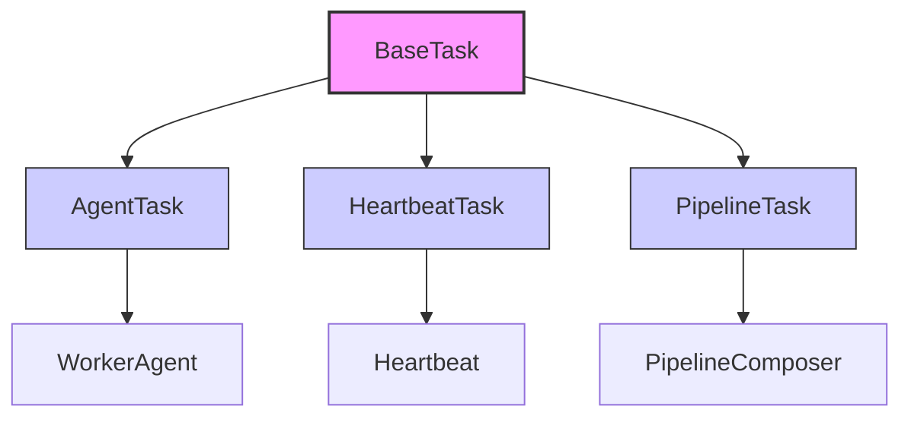

# BaseTask Class

## Overview

The `BaseTask` class serves as a foundational base class for task handling within the Sublimate Composer system. It provides a minimal structure that can be extended by more specific task implementations.

## Class Definition

```python
class BaseTask:
    def __init__(self):
        return
```

## Purpose

`BaseTask` is designed as a placeholder or abstract base class that:

1. **Establishes a common interface** for all task types in the system
2. **Provides extensibility** for future task implementations
3. **Handles task-related issues** (as indicated by the comment in the source code)

## Current Implementation

The current implementation is minimal, containing only an empty `__init__` method. This suggests that:

- The class is intended to be subclassed
- Future implementations will add task-specific functionality
- The class serves as a marker or interface definition

## Usage Example

```python
from src.orchestration.composer import BaseTask

class CustomTask(BaseTask):
    def __init__(self, task_name, task_data):
        super().__init__()
        self.name = task_name
        self.data = task_data
        self.status = "pending"

    def execute(self):
        """Execute the task logic"""
        self.status = "running"
        # Task implementation here
        self.status = "completed"
        return f"Task {self.name} completed"

# Create and execute a custom task
task = CustomTask("process_data", {"input": "sample.txt"})
result = task.execute()
print(result)  # Output: Task process_data completed
```

## Design Considerations

### Why Use BaseTask?

1. **Consistency**: Ensures all task classes follow the same basic structure
2. **Future-Proofing**: Allows for adding common functionality to all tasks later
3. **Type Checking**: Enables isinstance checks for task objects
4. **Documentation**: Clearly indicates the purpose of task-related classes

### When to Extend BaseTask

Extend `BaseTask` when creating:
- **Agent tasks** that need to be executed by agents
- **Scheduled tasks** for heartbeat execution
- **Pipeline tasks** for sequential workflows
- **Background tasks** for asynchronous processing

## Relationship with Other Classes



## Future Enhancements

Potential additions to `BaseTask`:

```python
class EnhancedBaseTask:
    def __init__(self, task_id=None):
        self.task_id = task_id or str(uuid.uuid4())
        self.created_at = datetime.now()
        self.updated_at = datetime.now()
        self.status = "pending"
        self.result = None
        self.error = None

    def to_dict(self):
        """Convert task to dictionary representation"""
        return {
            "task_id": self.task_id,
            "created_at": self.created_at.isoformat(),
            "updated_at": self.updated_at.isoformat(),
            "status": self.status,
            "result": self.result,
            "error": self.error
        }

    def update_status(self, status):
        """Update task status and timestamp"""
        self.status = status
        self.updated_at = datetime.now()

    def set_result(self, result):
        """Set task result and mark as completed"""
        self.result = result
        self.update_status("completed")

    def set_error(self, error):
        """Set task error and mark as failed"""
        self.error = str(error)
        self.update_status("failed")
```

## Best Practices

1. **Always call super().__init__()** in subclasses
2. **Document task requirements** in subclass docstrings
3. **Implement error handling** in task execution methods
4. **Consider task persistence** for long-running tasks
5. **Use task IDs** for tracking and debugging

## Testing Guidelines

When testing `BaseTask` subclasses:

```python
import pytest
from unittest.mock import Mock, patch

def test_task_initialization():
    """Test that tasks initialize correctly"""
    task = CustomTask("test_task", {})
    assert task.name == "test_task"
    assert task.data == {}
    assert task.status == "pending"

def test_task_execution():
    """Test task execution flow"""
    task = CustomTask("test_task", {})
    result = task.execute()
    assert result == "Task test_task completed"
    assert task.status == "completed"

def test_task_error_handling():
    """Test task error handling"""
    task = FaultyTask("faulty_task", {})
    with pytest.raises(TaskError):
        task.execute()
    assert task.status == "failed"
```

## Integration Points

`BaseTask` can integrate with:

1. **Agent System**: Tasks executed by `WorkerAgent` instances
2. **Scheduler**: Tasks scheduled via `Heartbeat` instances
3. **Pipeline**: Tasks chained in `PipelineComposer` workflows
4. **Monitoring**: Task status tracked in monitoring systems
5. **Logging**: Task execution logged for audit trails

## Common Patterns

### Task Factory Pattern

```python
class TaskFactory:
    @staticmethod
    def create_task(task_type, **kwargs):
        """Create task based on type"""
        task_classes = {
            "agent": AgentTask,
            "heartbeat": HeartbeatTask,
            "pipeline": PipelineTask,
            "custom": CustomTask
        }

        if task_type not in task_classes:
            raise ValueError(f"Unknown task type: {task_type}")

        return task_classes[task_type](**kwargs)

# Usage
task = TaskFactory.create_task("agent", agent_name="coder", instruction="Write tests")
```

### Task Decorator Pattern

```python
def task_logger(func):
    """Decorator to log task execution"""
    def wrapper(task_instance, *args, **kwargs):
        print(f"[{datetime.now()}] Starting task: {task_instance.name}")
        try:
            result = func(task_instance, *args, **kwargs)
            print(f"[{datetime.now()}] Task completed: {task_instance.name}")
            return result
        except Exception as e:
            print(f"[{datetime.now()}] Task failed: {task_instance.name} - {e}")
            raise
    return wrapper

class LoggedTask(BaseTask):
    def __init__(self, name):
        super().__init__()
        self.name = name

    @task_logger
    def execute(self):
        """Execute task with logging"""
        # Task implementation
        return f"Result from {self.name}"
```

## Performance Considerations

1. **Lightweight Instances**: Keep task objects lightweight
2. **Memory Management**: Clean up completed tasks when no longer needed
3. **Concurrent Execution**: Design tasks for parallel execution when possible
4. **State Persistence**: Consider serialization for long-running tasks

## Security Considerations

1. **Input Validation**: Validate all task parameters
2. **Access Control**: Restrict task creation to authorized users/agents
3. **Resource Limits**: Implement limits on task execution time and resources
4. **Audit Logging**: Log all task creation and execution events

## Migration Strategy

When extending `BaseTask` in existing code:

1. **Backward Compatibility**: Maintain existing interfaces
2. **Gradual Migration**: Migrate tasks incrementally
3. **Testing**: Test each task type after migration
4. **Documentation**: Update documentation for new task features

## Related Documentation

- [WorkerAgent Documentation](./WorkerAgent.md)
- [Heartbeat Documentation](./Heartbeat.md)
- [PipelineComposer Documentation](./PipelineComposer.md)
- [Composer Overview](../composer.md)

## Summary

The `BaseTask` class provides a foundation for task management in the Sublimate Composer system. While currently minimal, it establishes a pattern for task implementation and enables future enhancements for task tracking, persistence, and orchestration.
