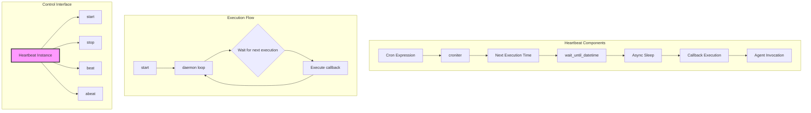
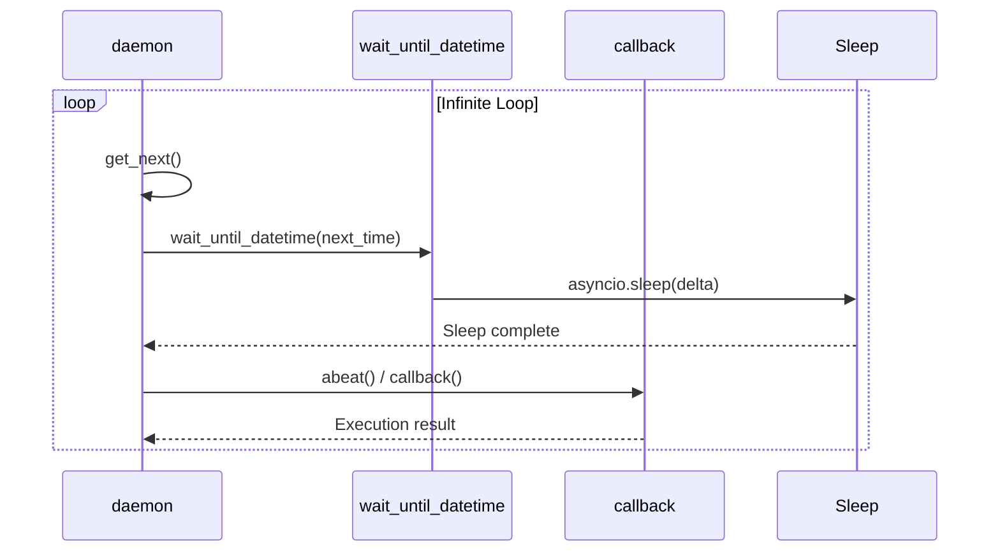

# Heartbeat Class

## Overview

The `Heartbeat` class provides scheduled execution capabilities for AI agents using cron expressions. It enables periodic, automated execution of agents at specified intervals, making it ideal for background tasks, regular maintenance, and continuous integration workflows.

## Architecture Diagram



## Class Definition

```python
class Heartbeat:
    def __init__(self, cron, callback):
        self.cron = cron
        self.callback = callback
        self.current = None
```

## Core Responsibilities

1. **Schedule Management**: Parse and manage cron expressions for execution timing
2. **Time Calculation**: Determine next execution time using `croniter`
3. **Async Scheduling**: Wait asynchronously until next execution time
4. **Execution Orchestration**: Invoke callback functions at scheduled times
5. **Lifecycle Control**: Start and stop heartbeat daemons
6. **Error Handling**: Manage execution failures and retries

## Constructor Parameters

| Parameter | Type | Required | Description |
|-----------|------|----------|-------------|
| `cron` | `str` | Yes | Cron expression defining execution schedule |
| `callback` | `Callable` | Yes | Function to execute on each heartbeat |

## Key Attributes

| Attribute | Type | Description |
|-----------|------|-------------|
| `cron` | `str` | Cron expression string |
| `callback` | `Callable` | Function to execute on heartbeat |
| `current` | `asyncio.Task` or `None` | Currently running daemon task |

## Cron Expression Format

The `cron` parameter uses standard cron syntax with 5 fields:

```
┌───────────── minute (0 - 59)
│ ┌───────────── hour (0 - 23)
│ │ ┌───────────── day of month (1 - 31)
│ │ │ ┌───────────── month (1 - 12)
│ │ │ │ ┌───────────── day of week (0 - 6) (Sunday to Saturday)
│ │ │ │ │
* * * * *
```

### Common Examples
| Expression | Description |
|------------|-------------|
| `"* * * * *"` | Every minute |
| `"*/5 * * * *"` | Every 5 minutes |
| `"0 * * * *"` | Hourly at minute 0 |
| `"0 0 * * *"` | Daily at midnight |
| `"0 9 * * 1-5"` | Weekdays at 9 AM |
| `"0 0 1 * *"` | First day of each month |

## Core Methods

### `__init__(cron, callback)`

Initializes a heartbeat with schedule and callback.

**Example:**
```python
def agent_task():
    return "Agent executed successfully"

heartbeat = Heartbeat("*/30 * * * *", agent_task)
```

### `get_next()`

Calculates the next execution time using `croniter`.

**Returns:** `croniter` iterator for next execution time

**Implementation:**
```python
def get_next(self):
    return croniter(self.cron, datetime.now())
```

### `wait_until_datetime(target_datetime)`

Asynchronously sleeps until the target datetime.

**Parameters:** `target_datetime` - `datetime` object to wait until
**Returns:** `asyncio.sleep` coroutine

**Implementation:**
```python
def wait_until_datetime(self, target_datetime):
    now = datetime.now()
    delta = (target_datetime - now).total_seconds()
    if delta > 0:
        return asyncio.sleep(delta)
    return asyncio.sleep(0)
```

### `daemon()`

Main daemon loop that continuously executes the heartbeat.

**Flow:**


### `beat()`

Synchronously executes the heartbeat callback.

**Returns:** Result of callback execution

**Implementation:**
```python
def beat(self):
    # TODO: invoke with task or active task etc.
    # we should probably also save task data incase program stops suddenly
    return self.callback()
```

### `abeat()`

Asynchronously executes the heartbeat callback.

**Returns:** Async result of callback execution

**Note:** Currently calls `beat()`, but designed for async extension.

### `start()`

Starts the heartbeat daemon as an async task.

**Returns:** `asyncio.Task` object for the daemon
**Raises:** `RuntimeError` if heartbeat already running

**Implementation:**
```python
def start(self):
    if self.current:
        raise RuntimeError("Heartbeat already running")
    self.current = asyncio.create_task(self.daemon())
    return self.current
```

### `stop()`

Stops the heartbeat daemon.

**Returns:** Result of task cancellation, or `None` if not running

**Implementation:**
```python
def stop(self):
    if self.current:
        # stop asyncio create_task object.
        return self.current.cancel()
    return None  # no heartbeat to kill
```

## Usage Examples

### Basic Heartbeat Setup

```python
from src.orchestration.composer import Heartbeat
import asyncio

def simple_task():
    print(f"Heartbeat executed at {datetime.now()}")
    return "Task completed"

# Create heartbeat that runs every minute
heartbeat = Heartbeat("* * * * *", simple_task)

# Start the heartbeat
async def run_heartbeat():
    task = heartbeat.start()

    # Run for 5 minutes
    await asyncio.sleep(300)

    # Stop the heartbeat
    heartbeat.stop()
    await task  # Wait for task to complete

asyncio.run(run_heartbeat())
```

### Agent Integration

```python
from src.orchestration.composer import Heartbeat, WorkerAgent

# Create an agent
agent = WorkerAgent("coder", "./agents", model, [])

# Define agent task
def agent_heartbeat():
    return agent.invoke([
        {"role": "user", "content": "Check for any pending tasks"}
    ])

# Create heartbeat for agent (runs every 30 minutes)
heartbeat = Heartbeat("*/30 * * * *", agent_heartbeat)

# Start in background
task = heartbeat.start()

# Later, stop the heartbeat
heartbeat.stop()
```

### Multiple Heartbeats Coordination

```python
import asyncio
from src.orchestration.composer import Heartbeat

class HeartbeatManager:
    def __init__(self):
        self.heartbeats = {}

    def add_heartbeat(self, name, cron, callback):
        self.heartbeats[name] = Heartbeat(cron, callback)

    async def start_all(self):
        tasks = []
        for name, heartbeat in self.heartbeats.items():
            task = heartbeat.start()
            tasks.append((name, task))
            print(f"Started heartbeat: {name}")

        return tasks

    async def stop_all(self):
        for name, heartbeat in self.heartbeats.items():
            heartbeat.stop()
            print(f"Stopped heartbeat: {name}")

# Usage
manager = HeartbeatManager()
manager.add_heartbeat("cleanup", "0 2 * * *", cleanup_task)
manager.add_heartbeat("backup", "0 0 * * *", backup_task)
manager.add_heartbeat("monitor", "*/5 * * * *", monitor_task)

# Start all heartbeats
asyncio.run(manager.start_all())
```

## Error Handling

### Schedule Validation

```python
def validate_cron_expression(cron):
    """Validate cron expression syntax"""
    try:
        croniter(cron)
        return True
    except Exception as e:
        raise ValueError(f"Invalid cron expression '{cron}': {e}")

# Usage
try:
    validate_cron_expression("invalid-cron")
except ValueError as e:
    print(f"Schedule validation failed: {e}")
```

### Callback Error Handling

```python
class ResilientHeartbeat(Heartbeat):
    def __init__(self, cron, callback, max_retries=3):
        super().__init__(cron, callback)
        self.max_retries = max_retries
        self.retry_count = 0

    async def abeat(self):
        while self.retry_count < self.max_retries:
            try:
                result = await super().abeat()
                self.retry_count = 0  # Reset on success
                return result
            except Exception as e:
                self.retry_count += 1
                print(f"Heartbeat failed (attempt {self.retry_count}/{self.max_retries}): {e}")
                if self.retry_count >= self.max_retries:
                    raise
                await asyncio.sleep(60)  # Wait before retry
```

### Daemon Lifecycle Management

```python
class MonitoredHeartbeat(Heartbeat):
    def __init__(self, cron, callback):
        super().__init__(cron, callback)
        self.execution_count = 0
        self.last_execution = None
        self.errors = []

    async def daemon(self):
        while True:
            try:
                await self.wait_until_datetime(self.get_next())
                self.last_execution = datetime.now()
                await self.abeat()
                self.execution_count += 1
            except asyncio.CancelledError:
                print("Heartbeat cancelled")
                raise
            except Exception as e:
                self.errors.append((datetime.now(), str(e)))
                print(f"Heartbeat error: {e}")
                # Continue despite errors
```

## Performance Considerations

### Efficient Sleep Calculation

```python
class OptimizedHeartbeat(Heartbeat):
    async def daemon(self):
        while True:
            next_time = self.get_next().get_next(datetime)
            # Calculate sleep time once per iteration
            sleep_time = (next_time - datetime.now()).total_seconds()

            if sleep_time > 0:
                # Use a single sleep call
                await asyncio.sleep(sleep_time)

            try:
                await self.abeat()
            except Exception:
                # Log but continue
                pass
```

### Resource Management

```python
class ResourceAwareHeartbeat(Heartbeat):
    def __init__(self, cron, callback, max_concurrent=1):
        super().__init__(cron, callback)
        self.semaphore = asyncio.Semaphore(max_concurrent)
        self.active_tasks = set()

    async def abeat(self):
        async with self.semaphore:
            task = asyncio.create_task(self._safe_callback())
            self.active_tasks.add(task)
            try:
                return await task
            finally:
                self.active_tasks.remove(task)

    async def _safe_callback(self):
        # Wrapped callback with timeout
        try:
            return await asyncio.wait_for(
                self.callback(),
                timeout=300  # 5 minute timeout
            )
        except asyncio.TimeoutError:
            print("Heartbeat callback timed out")
            return None
```

## Security Considerations

### Callback Validation

```python
class SecureHeartbeat(Heartbeat):
    def __init__(self, cron, callback, allowed_callbacks=None):
        super().__init__(cron, callback)
        self.allowed_callbacks = allowed_callbacks or []

    async def abeat(self):
        # Validate callback is allowed
        callback_name = self.callback.__name__
        if self.allowed_callbacks and callback_name not in self.allowed_callbacks:
            raise SecurityError(f"Callback {callback_name} not allowed")

        return await super().abeat()
```

### Execution Context Isolation

```python
class IsolatedHeartbeat(Heartbeat):
    def __init__(self, cron, callback, isolation_context=None):
        super().__init__(cron, callback)
        self.isolation_context = isolation_context or {}

    async def abeat(self):
        # Execute in isolated context
        with self._create_isolation():
            return await super().abeat()

    def _create_isolation(self):
        # Implement context isolation (e.g., chroot, container, etc.)
        return IsolationContext(**self.isolation_context)
```

## Testing Strategies

### Unit Tests

```python
import pytest
from unittest.mock import Mock, patch, AsyncMock
import asyncio
from datetime import datetime, timedelta

def test_heartbeat_initialization():
    """Test heartbeat initialization"""
    mock_callback = Mock()
    heartbeat = Heartbeat("* * * * *", mock_callback)

    assert heartbeat.cron == "* * * * *"
    assert heartbeat.callback == mock_callback
    assert heartbeat.current is None

def test_heartbeat_start_stop():
    """Test heartbeat start and stop"""
    mock_callback = Mock()
    heartbeat = Heartbeat("* * * * *", mock_callback)

    # Start heartbeat
    task = heartbeat.start()
    assert heartbeat.current is not None
    assert isinstance(task, asyncio.Task)

    # Stop heartbeat
    result = heartbeat.stop()
    assert result is True  # Task was cancelled

    # Verify cannot start twice
    with pytest.raises(RuntimeError):
        heartbeat.start()

@pytest.mark.asyncio
async def test_heartbeat_execution():
    """Test heartbeat execution"""
    mock_callback = AsyncMock(return_value="test_result")
    heartbeat = Heartbeat("* * * * *", mock_callback)

    # Mock get_next to return immediate execution
    with patch.object(heartbeat, 'get_next') as mock_get_next:
        mock_iterator = Mock()
        mock_iterator.get_next.return_value = datetime.now()
        mock_get_next.return_value = mock_iterator

        # Start and immediately stop
        task = heartbeat.start()
        await asyncio.sleep(0.1)  # Allow one execution
        heartbeat.stop()

        # Verify callback was called
        mock_callback.assert_called_once()
```

### Integration Tests

```python
@pytest.mark.asyncio
async def test_heartbeat_schedule_accuracy():
    """Test that heartbeats execute at correct times"""
    execution_times = []

    def record_execution():
        execution_times.append(datetime.now())
        return "executed"

    # Create heartbeat that runs every 2 seconds
    heartbeat = Heartbeat("*/2 * * * * *", record_execution)  # Seconds field added

    # Start heartbeat
    task = heartbeat.start()

    # Run for 6 seconds
    await asyncio.sleep(6)

    # Stop heartbeat
    heartbeat.stop()

    # Should have executed ~3 times (at 0, 2, 4 seconds)
    assert 2 <= len(execution_times) <= 4

    # Verify spacing between executions
    for i in range(1, len(execution_times)):
        spacing = (execution_times[i] - execution_times[i-1]).total_seconds()
        assert 1.9 <= spacing <= 2.1  # Allow small timing variance
```

## Extension Patterns

### Retry Mechanism

```python
class RetryHeartbeat(Heartbeat):
    def __init__(self, cron, callback, retry_delay=60, max_retries=3):
        super().__init__(cron, callback)
        self.retry_delay = retry_delay
        self.max_retries = max_retries

    async def abeat(self):
        for attempt in range(self.max_retries):
            try:
                return await super().abeat()
            except Exception as e:
                if attempt == self.max_retries - 1:
                    raise
                print(f"Attempt {attempt + 1} failed, retrying in {self.retry_delay}s: {e}")
                await asyncio.sleep(self.retry_delay)
```

### Conditional Execution

```python
class ConditionalHeartbeat(Heartbeat):
    def __init__(self, cron, callback, condition=None):
        super().__init__(cron, callback)
        self.condition = condition or (lambda: True)

    async def abeat(self):
        if self.condition():
            return await super().abeat()
        return "Skipped - condition not met"
```

### Batch Processing

```python
class BatchHeartbeat(Heartbeat):
    def __init__(self, cron, callback, batch_size=10):
        super().__init__(cron, callback)
        self.batch_size = batch_size
        self.pending_items = []

    def add_item(self, item):
        self.pending_items.append(item)

    async def abeat(self):
        if not self.pending_items:
            return "No items to process"

        # Process in batches
        results = []
        for i in range(0, len(self.pending_items), self.batch_size):
            batch = self.pending_items[i:i + self.batch_size]
            result = await self.callback(batch)
            results.append(result)

        # Clear processed items
        self.pending_items = self.pending_items[len(results) * self.batch_size:]

        return f"Processed {len(results)} batches"
```

## Best Practices

### Schedule Design
1. **Avoid Overlapping**: Ensure heartbeats don't overlap if they share resources
2. **Consider Load**: Schedule resource-intensive tasks during off-peak hours
3. **Test Intervals**: Use longer intervals in production than in testing
4. **Document Schedules**: Document the purpose and timing of each heartbeat

### Error Handling
1. **Log Failures**: Log all heartbeat execution failures
2. **Implement Retries**: Add retry logic for transient failures
3. **Monitor Health**: Monitor heartbeat execution patterns
4. **Alert on Failures**: Set up alerts for critical heartbeat failures

### Performance
1. **Optimize Callbacks**: Keep callback execution time reasonable
2. **Limit Concurrency**: Control concurrent heartbeat executions
3. **Monitor Resources**: Track CPU and memory usage of heartbeats
4. **Clean Up**: Ensure proper cleanup of heartbeat resources

### Security
1. **Validate Inputs**: Validate all cron expressions and callbacks
2. **Limit Permissions**: Run heartbeats with minimal necessary permissions
3. **Audit Execution**: Log all heartbeat executions for audit trails
4. **Isolate Execution**: Consider container isolation for sensitive tasks

## Related Documentation

- [WorkerAgent Documentation](./WorkerAgent.md)
- [HeartbeatComposer Documentation](./HeartbeatComposer.md)
- [BaseComposer Documentation](./BaseComposer.md)
- [Composer Overview](../composer.md)

## Summary

The `Heartbeat` class provides a robust foundation for scheduled execution in the Sublimate Composer system. By leveraging cron expressions and asynchronous programming, it enables precise timing control for automated agent execution. The class is designed to be extensible, supporting various execution patterns, error handling strategies, and performance optimizations while maintaining simplicity and reliability for common use cases.
