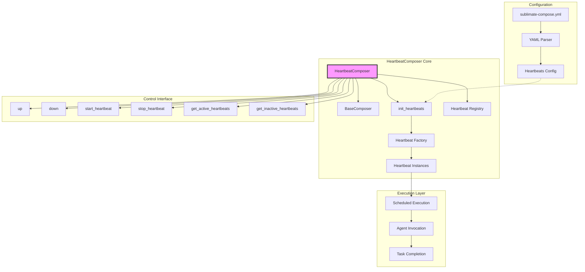

# HeartbeatComposer Class

## Overview

The `HeartbeatComposer` class extends `BaseComposer` to provide scheduled execution capabilities for AI agents. It manages multiple `Heartbeat` instances that run agents on cron schedules, enabling automated background tasks, periodic maintenance, and continuous integration workflows.

## Architecture Diagram



## Class Definition

```python
class HeartbeatComposer(BaseComposer):
    def __init__(self, *args, **kwargs):
        super().__init__(*args, **kwargs)
        self.heartbeats = {}
```

## Core Responsibilities

1. **Heartbeat Orchestration**: Manage multiple scheduled agent executions
2. **Schedule Configuration**: Parse and apply cron schedules from YAML
3. **Lifecycle Management**: Start and stop heartbeats on demand
4. **Dependency Resolution**: Handle agent dependencies in scheduled execution
5. **Monitoring**: Track active and inactive heartbeats
6. **Error Handling**: Manage heartbeat failures and recovery

## Inheritance Hierarchy

```
BaseComposer
    ↑
HeartbeatComposer
```

**Inherited Methods:**
- `init_chat_models()`
- `init_agents()`
- `init()`
- `get_agent()`
- `schedule_agent()`
- All utility methods

**Extended/Overridden Methods:**
- `init()` - Adds heartbeat initialization
- `up()` - Starts all heartbeats
- `down()` - Stops all heartbeats

**New Methods:**
- `init_heartbeats()`
- `init_heartbeat()`
- `get_active_heartbeats()`
- `get_inactive_heartbeats()`
- `get_heartbeat()`
- `start_heartbeat()`
- `stop_heartbeat()`

## Key Attributes

| Attribute | Type | Description |
|-----------|------|-------------|
| `heartbeats` | `Dict[str, Heartbeat]` | Registry of heartbeat instances |
| Inherits all attributes from `BaseComposer` | | |

## Configuration Requirements

### YAML Structure
```yaml
models:
  # Model definitions

agents:
  # Agent definitions

heartbeats:  # Required section
  agent-name:
    schedule: "cron-expression"
    # Optional: timeout, dependencies, path
```

### Complete Example
```yaml
models:
  default:
    model_provider: ollama
    model: qwen3.5:0.8b

agents:
  coder:
    model: default
    tools: [write_file, read_file]

  tester:
    model: default
    tools: [run_tests]

  deployer:
    model: default
    tools: [deploy]

heartbeats:
  coder:
    schedule: "*/30 * * * *"  # Every 30 minutes
    timeout: "5m"  # Optional: 5 minute timeout

  tester:
    schedule: "0 * * * *"  # Hourly at minute 0
    dependencies: [coder]  # Wait for coder to complete

  deployer:
    schedule: "0 2 * * *"  # Daily at 2 AM
    dependencies: [tester]  # Wait for tester
    path: ./heartbeats/deployer_special.md  # Custom instructions
```

## Core Methods

### `__init__(*args, **kwargs)`

Initializes the heartbeat composer by calling parent constructor and initializing heartbeat registry.

**Flow:**
```python
def __init__(self, *args, **kwargs):
    super().__init__(*args, **kwargs)
    self.heartbeats = {}
```

### `init_heartbeat(name, cron)`

Initializes a single heartbeat for an agent.

**Parameters:**
- `name`: Agent name string
- `cron`: Cron expression string

**Implementation:**
```python
def init_heartbeat(self, name, cron):
    self.heartbeats[name] = Heartbeat(
        cron,
        self.schedule_agent(name),  # Gets agent's run method
    )
```

### `init_heartbeats()`

Initializes all heartbeats from configuration.

**Process:**
1. Get heartbeat configurations from YAML
2. For each agent with heartbeat configuration:
   - Extract cron schedule
   - Call `init_heartbeat(name, cron)`

**Implementation:**
```python
def init_heartbeats(self):
    for agent_name, hb in self.get_heartbeats_from_settings().items():
        self.init_heartbeat(
            agent_name,
            hb["schedule"],
        )
```

### `init()`

Extended initialization that includes heartbeat setup.

**Overrides parent method to add:**
```python
def init(self):  # init_all
    super().init()  # Initialize models and agents
    self.init_heartbeats()  # Initialize heartbeats
```

### `up()`

Starts all configured heartbeats.

**Process:**
1. Initialize if not already initialized
2. Start heartbeat for each agent in configuration

**Implementation:**
```python
def up(self):
    if not self.heartbeats:
        self.init()
    for agent_name in self.get_heartbeats_from_settings().keys():
        self.start_heartbeat(agent_name)
```

### `down()`

Stops all active heartbeats.

**Implementation:**
```python
def down(self):
    for heartbeat in self.get_active_heartbeats().values():
        heartbeat.stop()
```

### `get_active_heartbeats()`

Returns list of currently running heartbeats.

**Implementation:**
```python
def get_active_heartbeats(self):
    return [hb for hb in self.heartbeats.values() if hb.current]
```

### `get_inactive_heartbeats()`

Returns list of stopped heartbeats.

**Implementation:**
```python
def get_inactive_heartbeats(self):
    return [hb for hb in self.heartbeats.values() if not hb.current]
```

### `get_heartbeat(name)`

Retrieves a heartbeat by agent name.

**Parameters:** `name` - Agent name string
**Returns:** `Heartbeat` instance or `None`

### `start_heartbeat(name)`

Starts a specific heartbeat.

**Parameters:** `name` - Agent name string
**Returns:** `asyncio.Task` or `None`

### `stop_heartbeat(name)`

Stops a specific heartbeat.

**Parameters:** `name` - Agent name string
**Returns:** Cancellation result or `None`

## Usage Examples

### Basic Heartbeat Composer Setup

```python
from src.orchestration.composer import HeartbeatComposer
import asyncio

# Define tools
tools = {
    'write_file': lambda p, c: f"Written to {p}",
    'read_file': lambda p: f"Content of {p}"
}

# Initialize composer
composer = HeartbeatComposer(
    agent_home="./my_agents",
    tools=tools
)

# Initialize everything (models, agents, heartbeats)
composer.init()

# Start all heartbeats
composer.up()

# Run for a while
async def run_for_duration(seconds):
    await asyncio.sleep(seconds)
    composer.down()

asyncio.run(run_for_duration(3600))  # Run for 1 hour
```

### Advanced Control

```python
from src.orchestration.composer import HeartbeatComposer
import asyncio

composer = HeartbeatComposer("./agents", {})
composer.init()

# Start specific heartbeats
coder_task = composer.start_heartbeat("coder")
tester_task = composer.start_heartbeat("tester")

# Monitor status
print(f"Active heartbeats: {len(composer.get_active_heartbeats())}")
print(f"Inactive heartbeats: {len(composer.get_inactive_heartbeats())}")

# Wait for some executions
await asyncio.sleep(300)  # 5 minutes

# Stop specific heartbeat
composer.stop_heartbeat("coder")

# Check status again
print(f"Active after stop: {len(composer.get_active_heartbeats())}")

# Start all remaining heartbeats
composer.up()

# Run overnight
await asyncio.sleep(28800)  # 8 hours

# Clean shutdown
composer.down()
```

### Error Handling and Recovery

```python
from src.orchestration.composer import HeartbeatComposer
import asyncio

class ResilientHeartbeatComposer(HeartbeatComposer):
    async def monitor_and_recover(self):
        """Monitor heartbeats and restart failed ones"""
        while True:
            await asyncio.sleep(60)  # Check every minute

            for name, heartbeat in self.heartbeats.items():
                if heartbeat.current and heartbeat.current.done():
                    # Heartbeat task completed (likely due to error)
                    print(f"Heartbeat {name} stopped unexpectedly")

                    # Check for exception
                    try:
                        heartbeat.current.result()
                    except Exception as e:
                        print(f"Error in heartbeat {name}: {e}")

                    # Restart the heartbeat
                    print(f"Restarting heartbeat {name}")
                    self.start_heartbeat(name)

# Usage
composer = ResilientHeartbeatComposer("./agents", {})
composer.init()
composer.up()

# Start monitoring
monitor_task = asyncio.create_task(composer.monitor_and_recover())

# Run indefinitely
try:
    await asyncio.Future()  # Run forever
except KeyboardInterrupt:
    composer.down()
    monitor_task.cancel()
```

## Configuration Management

### Dynamic Schedule Updates

```python
class DynamicHeartbeatComposer(HeartbeatComposer):
    def update_schedule(self, agent_name, new_cron):
        """Update an agent's schedule dynamically"""
        if agent_name not in self.heartbeats:
            raise ValueError(f"Agent {agent_name} not found")

        # Stop current heartbeat
        self.stop_heartbeat(agent_name)

        # Update configuration
        if "heartbeats" in self.data and agent_name in self.data["heartbeats"]:
            self.data["heartbeats"][agent_name]["schedule"] = new_cron

        # Reinitialize heartbeat
        self.init_heartbeat(agent_name, new_cron)

        # Restart if it was running
        if agent_name in self.get_heartbeats_from_settings():
            self.start_heartbeat(agent_name)

        # Save updated configuration
        self._save_configuration()

# Usage
composer = DynamicHeartbeatComposer("./agents", {})
composer.init()
composer.up()

# Change schedule dynamically
composer.update_schedule("coder", "*/15 * * * *")  # Every 15 minutes instead of 30
```

### Conditional Execution

```python
class ConditionalHeartbeatComposer(HeartbeatComposer):
    def __init__(self, *args, conditions=None, **kwargs):
        super().__init__(*args, **kwargs)
        self.conditions = conditions or {}

    def init_heartbeat(self, name, cron):
        # Wrap callback with condition check
        original_callback = self.schedule_agent(name)

        def conditional_callback():
            condition = self.conditions.get(name)
            if condition and not condition():
                return f"Heartbeat {name} skipped - condition not met"
            return original_callback()

        self.heartbeats[name] = Heartbeat(cron, conditional_callback)

# Usage
def should_run_coder():
    # Check if there are pending tasks
    return check_pending_tasks() > 0

composer = ConditionalHeartbeatComposer(
    "./agents",
    {},
    conditions={
        "coder": should_run_coder,
        "tester": lambda: True  # Always run
    }
)
composer.init()
composer.up()
```

## Performance Optimization

### Batch Processing

```python
class BatchHeartbeatComposer(HeartbeatComposer):
    def __init__(self, *args, batch_size=5, **kwargs):
        super().__init__(*args, **kwargs)
        self.batch_size = batch_size
        self.pending_tasks = {}

    def init_heartbeat(self, name, cron):
        # Store tasks for batch processing
        self.pending_tasks[name] = []

        def batch_callback():
            if not self.pending_tasks[name]:
                return f"No tasks for {name}"

            # Process in batches
            tasks = self.pending_tasks[name][:self.batch_size]
            self.pending_tasks[name] = self.pending_tasks[name][self.batch_size:]

            # Execute batch
            results = []
            for task in tasks:
                try:
                    result = task()
                    results.append(("success", result))
                except Exception as e:
                    results.append(("error", str(e)))

            return f"Processed {len(results)} tasks: {results}"

        self.heartbeats[name] = Heartbeat(cron, batch_callback)

    def add_task(self, agent_name, task):
        """Add a task to be processed in next heartbeat"""
        if agent_name not in self.pending_tasks:
            raise ValueError(f"Agent {agent_name} not found")
        self.pending_tasks[agent_name].append(task)

# Usage
composer = BatchHeartbeatComposer("./agents", {}, batch_size=3)
composer.init()

# Add tasks
for i in range(10):
    composer.add_task("coder", lambda: f"Task {i}")

composer.up()
# Heartbeats will process 3 tasks at a time
```

### Resource Throttling

```python
class ThrottledHeartbeatComposer(HeartbeatComposer):
    def __init__(self, *args, max_concurrent=3, **kwargs):
        super().__init__(*args, **kwargs)
        self.max_concurrent = max_concurrent
        self.semaphore = asyncio.Semaphore(max_concurrent)
        self.running_count = 0

    def init_heartbeat(self, name, cron):
        original_callback = self.schedule_agent(name)

        async def throttled_callback():
            async with self.semaphore:
                self.running_count += 1
                try:
                    return await original_callback()
                finally:
                    self.running_count -= 1

        self.heartbeats[name] = Heartbeat(cron, throttled_callback)

    def get_utilization(self):
        """Get current resource utilization"""
        return self.running_count / self.max_concurrent

# Usage
composer = ThrottledHeartbeatComposer("./agents", {}, max_concurrent=2)
composer.init()
composer.up()

# Monitor utilization
async def monitor_utilization():
    while True:
        await asyncio.sleep(10)
        util = composer.get_utilization()
        print(f"Heartbeat utilization: {util:.1%}")

asyncio.create_task(monitor_utilization())
```

## Monitoring and Observability

### Health Monitoring

```python
class MonitoredHeartbeatComposer(HeartbeatComposer):
    def __init__(self, *args, **kwargs):
        super().__init__(*args, **kwargs)
        self.metrics = {
            'executions': {},
            'errors': {},
            'durations': {}
        }

    def init_heartbeat(self, name, cron):
        original_callback = self.schedule_agent(name)

        def monitored_callback():
            start_time = datetime.now()

            # Initialize metrics
            if name not in self.metrics['executions']:
                self.metrics['executions'][name] = 0
                self.metrics['errors'][name] = 0
                self.metrics['durations'][name] = []

            try:
                result = original_callback()
                self.metrics['executions'][name] += 1

                # Record duration
                duration = (datetime.now() - start_time).total_seconds()
                self.metrics['durations'][name].append(duration)

                return result
            except Exception as e:
                self.metrics['errors'][name] += 1
                raise

    def get_metrics(self):
        """Get comprehensive metrics"""
        return {
            'heartbeats': len(self.heartbeats),
            'active': len(self.get_active_heartbeats()),
            'inactive': len(self.get_inactive_heartbeats()),
            'detailed': self.metrics
        }

    def get_health_status(self):
        """Get health status summary"""
        status = {}
        for name, heartbeat in self.heartbeats.items():
            executions = self.metrics['executions'].get(name, 0)
            errors = self.metrics['errors'].get(name, 0)

            status[name] = {
                'active': heartbeat.current is not None,
                'executions': executions,
                'error_rate': errors / max(executions, 1),
                'avg_duration': np.mean(self.metrics['durations'].get(name, [0]))
            }
        return status

# Usage
composer = MonitoredHeartbeatComposer("./agents", {})
composer.init()
composer.up()

# Periodically check health
async def health_check():
    while True:
        await asyncio.sleep(300)  # Every 5 minutes
        health = composer.get_health_status()
        for agent, stats in health.items():
            if stats['error_rate'] > 0.1:  # 10% error rate threshold
                print(f"Warning: {agent} has high error rate: {stats['error_rate']:.1%}")

        metrics = composer.get_metrics()
        print(f"Total executions: {sum(metrics['detailed']['executions'].values())}")
```

## Testing Strategies

### Unit Tests

```python
import pytest
from unittest.mock import Mock, patch, MagicMock, AsyncMock
import asyncio

def test_heartbeat_composer_initialization():
    """Test heartbeat composer initialization"""
    with patch("src.orchestration.composer.BaseComposer.__init__") as mock_parent_init:
        composer = HeartbeatComposer("test_home", {})

        mock_parent_init.assert_called_once_with("test_home", {})
        assert composer.heartbeats == {}

def test_init_heartbeats():
    """Test heartbeat initialization from configuration"""
    composer = HeartbeatComposer("test_home", {})

    # Mock configuration
    composer.data = {
        "heartbeats": {
            "coder": {"schedule": "* * * * *"},
            "tester": {"schedule": "0 * * * *"}
        }
    }

    # Mock schedule_agent
    composer.schedule_agent = Mock(return_value=lambda: "agent_run")

    # Mock Heartbeat constructor
    with patch("src.orchestration.composer.Heartbeat") as MockHeartbeat:
        mock_hb = MagicMock()
        MockHeartbeat.return_value = mock_hb

        composer.init_heartbeats()

        assert len(composer.heartbeats) == 2
        assert "coder" in composer.heartbeats
        assert "tester" in composer.heartbeats
        MockHeartbeat.assert_any_call("* * * * *", Mock.return_value)
        MockHeartbeat.assert_any_call("0 * * * *", Mock.return_value)

@pytest.mark.asyncio
async def test_up_and_down():
    """Test starting and stopping heartbeats"""
    composer = HeartbeatComposer("test_home", {})

    # Mock heartbeats
    mock_hb1 = AsyncMock()
    mock_hb1.current = None
    mock_hb1.start.return_value = "task1"

    mock_hb2 = AsyncMock()
    mock_hb2.current = None
    mock_hb2.start.return_value = "task2"

    composer.heartbeats = {
        "coder": mock_hb1,
        "tester": mock_hb2
    }

    # Mock configuration
    composer.get_heartbeats_from_settings = Mock(return_value={
        "coder": {"schedule": "* * * * *"},
        "tester": {"schedule": "0 * * * *"}
    })

    # Test up()
    composer.up()

    mock_hb1.start.assert_called_once()
    mock_hb2.start.assert_called_once()

    # Test down()
    mock_hb1.current = "task1"
    mock_hb2.current = "task2"

    composer.down()

    mock_hb1.stop.assert_called_once()
    mock_hb2.stop.assert_called_once()
```

### Integration Tests

```python
@pytest.mark.asyncio
async def test_heartbeat_execution_flow():
    """Test complete heartbeat execution flow"""
    with tempfile.TemporaryDirectory() as tmpdir:
        # Create configuration
        config = {
            "models": {
                "default": {"model_provider": "ollama", "model": "test"}
            },
            "agents": {
                "test_agent": {"model": "default", "tools": []}
            },
            "heartbeats": {
                "test_agent": {"schedule": "* * * * *"}
            }
        }

        config_path = os.path.join(tmpdir, "sublimate-compose.yml")
        with open(config_path, 'w') as f:
            yaml.dump(config, f)

        # Create agent files
        agent_dir = os.path.join(tmpdir, "agents")
        os.makedirs(agent_dir)
        os.makedirs(os.path.join(agent_dir, "heartbeats"))

        with open(os.path.join(agent_dir, "test_agent.md"), 'w') as f:
            f.write("# Test Agent")

        with open(os.path.join(agent_dir, "heartbeats", "test_agent.md"), 'w') as f:
            f.write("# Test Heartbeat")

        # Mock dependencies
        with patch("langchain.chat_models.init_chat_model") as mock_model:
            with patch("langchain.agents.create_agent") as mock_agent:
                mock_agent_instance = AsyncMock()
                mock_agent_instance.invoke.return_value = "Agent response"
                mock_agent_instance.ainvoke.return_value = "Async response"
                mock_agent.return_value = mock_agent_instance

                # Create composer
                composer = HeartbeatComposer(agent_dir, {})
                composer.init()

                # Start heartbeat
                composer.up()

                # Wait for execution
                await asyncio.sleep(2)

                # Stop heartbeat
                composer.down()

                # Verify agent was invoked
                # Note: Actual invocation depends on timing
                assert "test_agent" in composer.heartbeats
```

## Best Practices

### Configuration Management
1. **Version Control**: Keep heartbeat configurations in version control
2. **Environment Separation**: Use different schedules for dev/test/prod
3. **Documentation**: Document the purpose and schedule of each heartbeat
4. **Backup**: Regular backups of heartbeat configurations

### Schedule Design
1. **Load Distribution**: Stagger heartbeats to avoid resource contention
2. **Dependency Ordering**: Configure dependencies for sequential execution
3. **Timeout Settings**: Set appropriate timeouts for each heartbeat
4. **Error Handling**: Configure retry logic for transient failures

### Monitoring
1. **Health Checks**: Implement regular health checks for heartbeats
2. **Metrics Collection**: Collect execution metrics for analysis
3. **Alerting**: Set up alerts for heartbeat failures
4. **Logging**: Comprehensive logging of all heartbeat operations

### Performance
1. **Resource Limits**: Set limits on concurrent executions
2. **Optimization**: Optimize agent callbacks for efficiency
3. **Cleanup**: Regular cleanup of completed heartbeat tasks
4. **Scaling**: Design for horizontal scaling if needed

## Related Documentation

- [Heartbeat Documentation](./Heartbeat.md)
- [BaseComposer Documentation](./BaseComposer.md)
- [BaseAgent Documentation](./BaseAgent.md)
- [Composer Overview](../composer.md)

## Summary

The `HeartbeatComposer` class provides a powerful orchestration layer for scheduled AI agent execution. By combining the configuration management capabilities of `BaseComposer` with the scheduling power of `Heartbeat`, it enables complex automated workflows with precise timing control. The class supports dynamic schedule updates, conditional execution, batch processing, and comprehensive monitoring, making it suitable for production deployments requiring reliable scheduled task execution.
