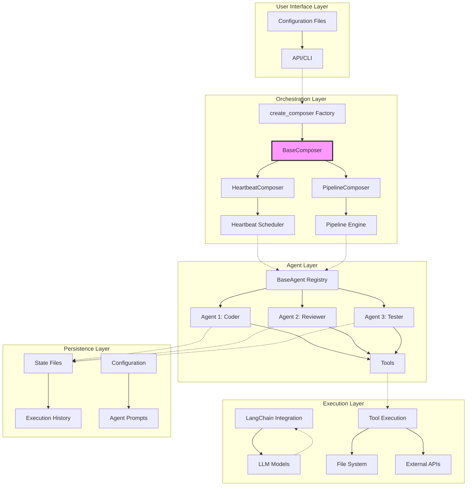
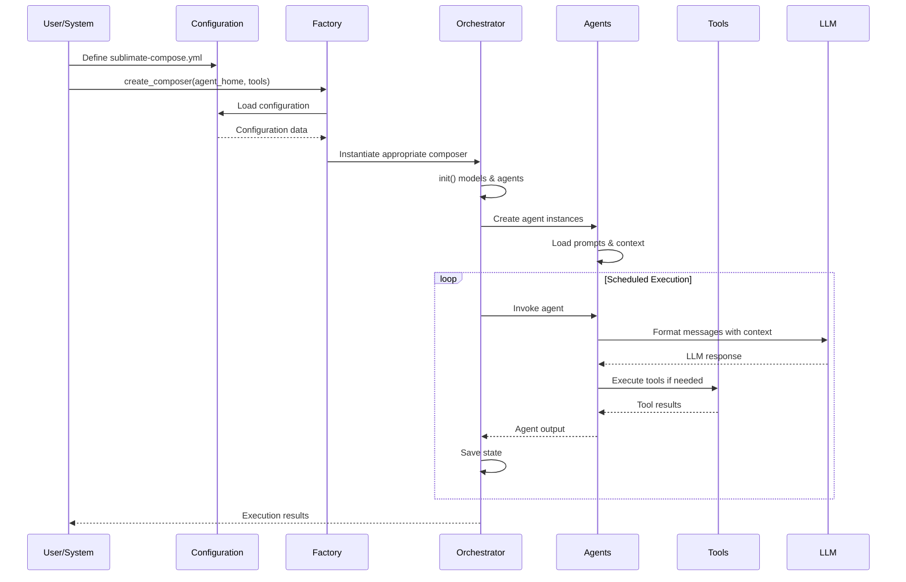
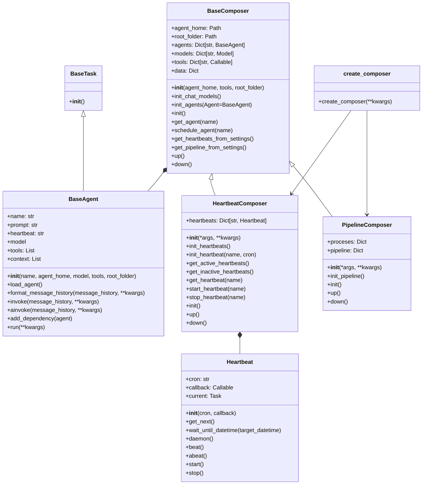
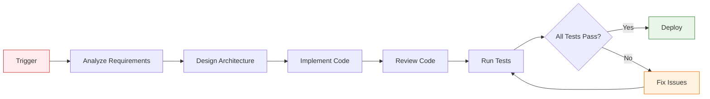
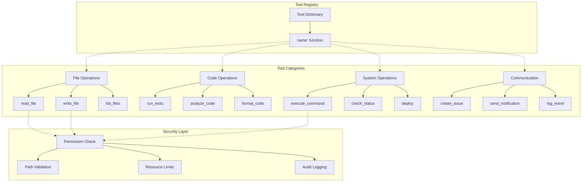
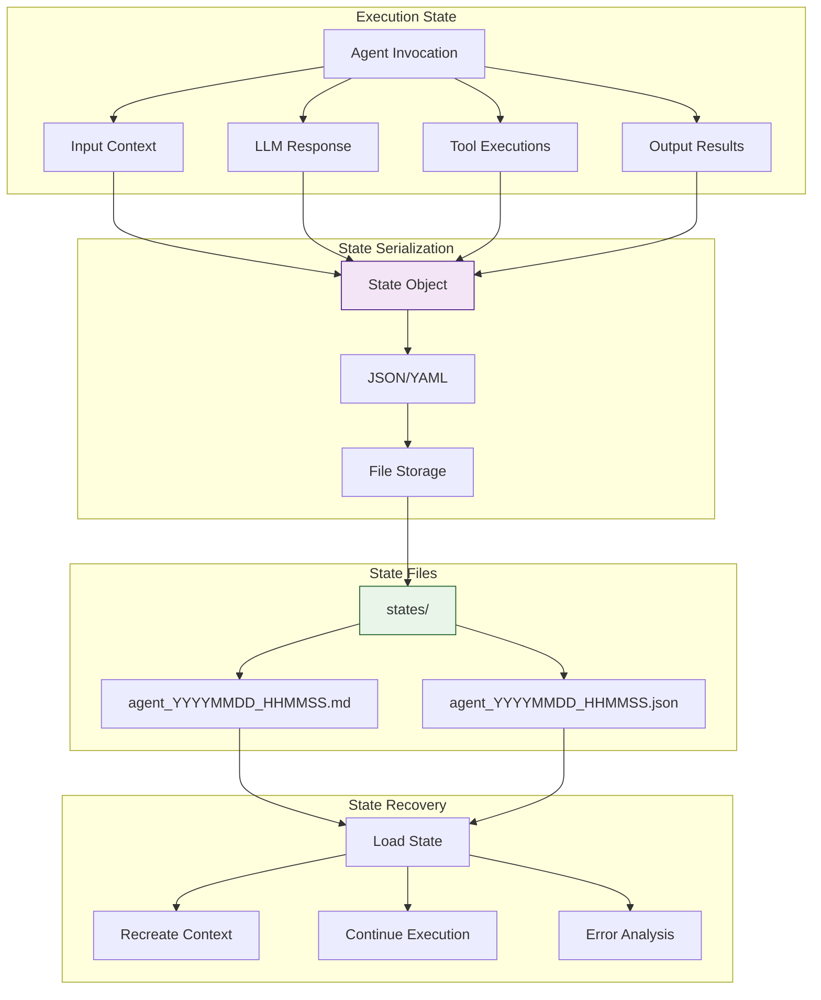
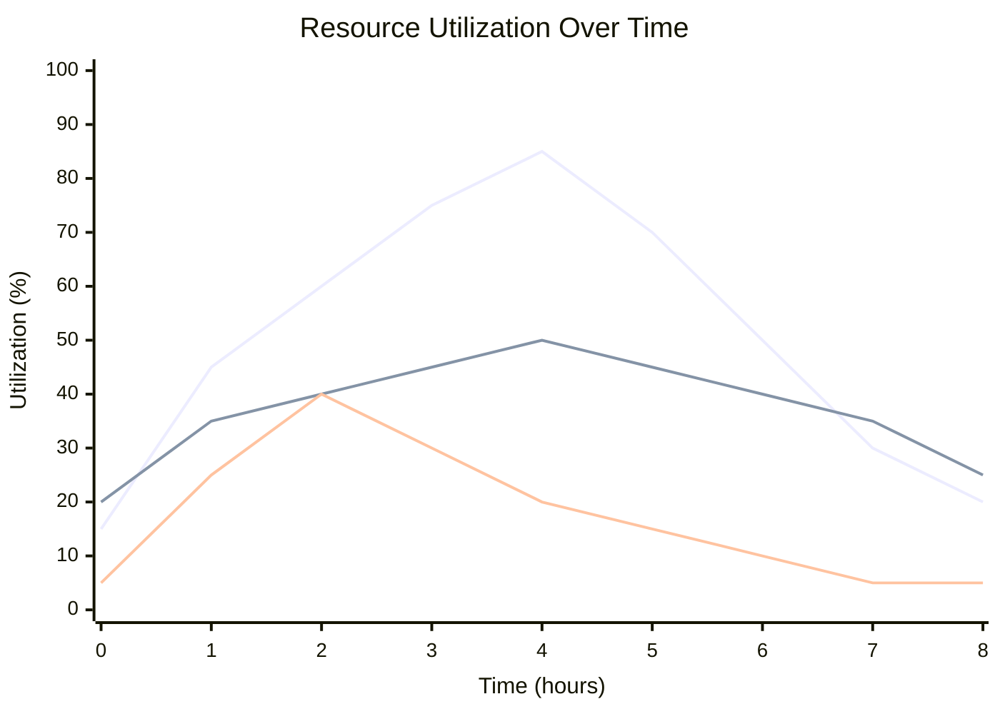

# Composer Module: Complete System Overview

## Executive Summary

The Composer module is the central orchestration system for AI-powered software development in the Sublimate platform. It enables the creation, management, and coordination of multiple AI agents that can autonomously work on codebases, execute tasks on schedules, and collaborate through defined workflows.

## System Architecture



## Core Design Principles

### 1. Configuration-Driven
- **YAML-based configuration** for declarative agent definitions
- **Environment-agnostic** design for portability
- **Version-controlled** configurations for reproducibility

### 2. Extensible Architecture
- **Plugin-friendly** design for custom tools and agents
- **Modular components** that can be replaced or extended
- **Open interfaces** for integration with other systems

### 3. Fault-Tolerant
- **Graceful degradation** when components fail
- **Automatic recovery** from transient errors
- **Comprehensive logging** for debugging and audit

### 4. Scalable Design
- **Stateless agents** for horizontal scaling
- **Efficient resource utilization** with lazy loading
- **Parallel execution** capabilities for performance

## Component Relationships

### Data Flow Diagram



### Class Dependency Graph



## Configuration Ecosystem

### File Structure
```
project-root/
├── sublimate-compose.yml          # Main configuration
├── AGENTS.md                      # Global agent documentation
├── README.md                      # Project documentation
└── agents/                        # Agent home directory
    ├── coder.md                   # Coder agent prompt
    ├── reviewer.md                # Reviewer agent prompt
    ├── tester.md                  # Tester agent prompt
    ├── heartbeats/                # Heartbeat instructions
    │   ├── coder.md
    │   ├── reviewer.md
    │   └── tester.md
    └── states/                    # Execution state files
        ├── coder_20250101_120000.md
        └── reviewer_20250101_123000.md
```

### Configuration Inheritance
```mermaid
graph TB
    A[Global Configuration<br/>sublimate-compose.yml] --> B[Agent Definitions]
    A --> C[Model Definitions]
    A --> D[Execution Strategy]
    
    B --> E[Individual Agent<br/>{name}.md]
    D --> F[Heartbeat Instructions<br/>heartbeats/{name}.md]
    
    G[Project Context<br/>AGENTS.md, README.md] --> H[Agent Context]
    I[External Docs<br/>docs/*] --> H
    
    E --> J[Agent Instance]
    F --> J
    H --> J
    
    style A fill:#e1f5fe,stroke:#01579b
    style E fill:#f3e5f5,stroke:#4a148c
    style F fill:#e8f5e8,stroke:#1b5e20
    style G fill:#fff3e0,stroke:#e65100
```

## Execution Models

### 1. Heartbeat-Based Execution (Current)
```mermaid
timeline
    title Heartbeat Execution Timeline
    section Agent: Coder
        Every 30 minutes : Load context
                         : Invoke LLM
                         : Execute tools
                         : Save state
    section Agent: Reviewer
        Hourly at :00    : Wait for coder
                         : Review changes
                         : Create issues
    section Agent: Tester
        Daily at 2 AM    : Run test suite
                         : Generate report
                         : Notify failures
```

### 2. Pipeline-Based Execution (Planned)


## Tool Integration Framework

### Tool Architecture


### Tool Execution Flow
```python
# 1. Tool Definition
def safe_write_file(path: str, content: str) -> str:
    """Write content to file with security checks"""
    validate_path(path, allowed_patterns=["./src/**", "./tests/**"])
    check_permissions(path, "write")
    
    with open(path, 'w') as f:
        f.write(content)
    
    audit_log("file_write", path=path, size=len(content))
    return f"Written {len(content)} bytes to {path}"

# 2. Tool Registration
tools = {
    'write_file': safe_write_file,
    'read_file': safe_read_file,
    'run_tests': run_tests_tool
}

# 3. Tool Assignment to Agents
agents:
  coder:
    model: default
    tools: [write_file, read_file, run_tests]
  
  reviewer:
    model: default
    tools: [read_file, create_issue]  # No write access
```

## State Management

### State Persistence Model


### State File Format
```markdown
# Agent Run: coder
Timestamp: 2026-04-05T10:30:00
Message history length: 5
Dependencies: [reviewer, tester]

## Context Files
- AGENTS.md (342 lines)
- README.md (156 lines)
- docs/architecture.md (89 lines)

## Input
```json
{
  "role": "user",
  "content": "Implement user authentication middleware"
}
```

## Output
```json
{
  "action": "write_file",
  "path": "./src/auth/middleware.py",
  "content": "def authenticate_user(...)"
}
```

## Tool Executions
1. write_file: ./src/auth/middleware.py (success)
2. run_tests: ./tests/test_auth.py (success)

## Duration: 45.2 seconds
## Status: completed
```

## Error Handling Strategy

### Multi-Layer Error Handling

```mermaid
graph TB
    subgraph "Layer 1: Configuration Errors"
        A[Invalid YAML] --> B[Parse Error]
        C[Missing Sections] --> D[Validation Error]
        E[Invalid Paths] --> F[File Error]
    end
    
    subgraph "Layer 2: Initialization Errors"
        G[Model Unavailable] --> H[Connection Error]
        I[Agent Files Missing] --> J[Load Error]
        K[Tool Registration Failed] --> L[Integration Error]
    end
    
    subgraph "Layer 3: Execution Errors"
        M[LLM Timeout] --> N[Timeout Error]
        O[Tool Failure] --> P[Runtime Error]
        Q[Dependency Deadlock] --> R[Deadlock Error]
    end
    
    subgraph "Layer 4: Recovery Strategies"
        S[Retry Logic] --> T[Exponential Backoff]
        U[Fallback Agents] --> V[Graceful Degradation]
        W[State Checkpoint] --> X[Resume from Checkpoint]
    end
    
    B --> Y[User Notification]
    D --> Y
    F --> Y
    H --> Z[Automatic Recovery]
    J --> Z
    L --> Z
    N --> AA[Circuit Breaker]
    P --> AA
    R --> AA
    T --> AB[Continued Operation]
    V --> AB
    X --> AB
    
    style Y fill:#ffebee,stroke:#c62828
    style Z fill:#fff3e0,stroke:#ef6c00
    style AA fill:#e3f2fd,stroke:#1565c0
    style AB fill:#e8f5e8,stroke:#2e7d32
```


### Error Recovery Examples
```python
class ResilientComposer(BaseComposer):
    async def execute_with_retry(self, agent_name, message, max_retries=3):
        """Execute agent with automatic retry on failure"""
        for attempt in range(max_retries):
            try:
                agent = self.get_agent(agent_name)
                return await agent.ainvoke([{"role": "user", "content": message}])
            except (TimeoutError, ConnectionError) as e:
                if attempt == max_retries - 1:
                    raise
                delay = 2 ** attempt  # Exponential backoff
                await asyncio.sleep(delay)
            except Exception as e:
                # Log and try fallback agent
                logger.error(f"Agent {agent_name} failed: {e}")
                return await self.fallback_execution(message)
    
    async def fallback_execution(self, message):
        """Execute with simplified fallback agent"""
        fallback_agent = create_fallback_agent()
        return await fallback_agent.ainvoke([{"role": "user", "content": message}])
```

## Performance Characteristics

### Resource Utilization Profile


### Optimization Strategies

#### 1. Lazy Loading
```python
class OptimizedBaseAgent(BaseAgent):
    def __init__(self, *args, **kwargs):
        super().__init__(*args, **kwargs)
        self._prompt_loaded = False
        self._context_loaded = False
    
    @property
    def prompt(self):
        if not self._prompt_loaded:
            self.load_file("prompt", self.agent_file_paths[0][1])
            self._prompt_loaded = True
        return self._prompt
    
    def load_context_on_demand(self):
        if not self._context_loaded:
            self.load_files_for(self.context, self.context_files)
            self._context_loaded = True
```

#### 2. Caching
```python
class CachedComposer(BaseComposer):
    def __init__(self, *args, cache_ttl=300, **kwargs):
        super().__init__(*args, **kwargs)
        self.cache_ttl = cache_ttl
        self._model_cache = {}
        self._config_cache = {}
        self._cache_timestamps = {}
    
    def init_chat_model(self, model, model_data):
        cache_key = f"{model}:{hash(str(model_data))}"
        
        if cache_key in self._model_cache:
            # Check if cache is still valid
            if time.time() - self._cache_timestamps[cache_key] < self.cache_ttl:
                return self._model_cache[cache_key]
        
        # Create and cache new model
        model_instance = super().init_chat_model(model, model_data)
        self._model_cache[cache_key] = model_instance
        self._cache_timestamps[cache_key] = time.time()
        
        return model_instance
```

#### 3. Connection Pooling
```python
class PooledComposer(BaseComposer):
    def __init__(self, *args, pool_size=5, **kwargs):
        super().__init__(*args, **kwargs)
        self.pool_size = pool_size
        self.model_pool = []
        self.pool_lock = asyncio.Lock()
    
    async def get_model_from_pool(self, model_name):
        async with self.pool_lock:
            if not self.model_pool:
                # Create new model instance
                model = self.models[model_name]
                self.model_pool.append(model)
            
            return self.model_pool.pop()
    
    async def return_model_to_pool(self, model):
        async with self.pool_lock:
            if len(self.model_pool) < self.pool_size:
                self.model_pool.append(model)
```

## Security Model

### Defense in Depth

```mermaid
graph TB
    subgraph "Layer 1: Configuration Security"
        A[YAML Validation] --> B[Schema Enforcement]
        C[Path Sanitization] --> D[Traversal Prevention]
        E[Secret Management] --> F[Encrypted Storage]
    end
    
    subgraph "Layer 2: Runtime Security"
        G[Tool Sandboxing] --> H[Resource Limits]
        I[Input Validation] --> J[Output Sanitization]
        K[Permission Checks] --> L[Access Control]
    end
    
    subgraph "Layer 3: Communication Security"
        M[API Encryption] --> N[TLS/SSL]
        O[Authentication] --> P[Authorization]
        Q[Audit Logging] --> R[Tamper Detection]
    end
    
    subgraph "Layer 4: Monitoring & Response"
        S[Anomaly Detection] --> T[Alerting]
        U[Incident Response] --> V[Forensic Analysis]
        W[Patch Management] --> X[Vulnerability Scanning]
    end
    
    B --> Y[Secure Execution]
    D --> Y
    F --> Y
    H --> Z[Contained Environment]
    J --> Z
    L --> Z
    N --> AA[Protected Communications]
    P --> AA
    R --> AA
    T --> AB[Proactive Defense]
    V --> AB
    X --> AB
    
    style Y fill:#f3e5f5,stroke:#4a148c
    style Z fill:#e8f5e8,stroke:#1b5e20
    style AA fill:#e3f2fd,stroke:#1565c0
    style AB fill:#fff3e0,stroke:#ef6c00
```


### Security Implementation Examples
```python
class SecureComposer(BaseComposer):
    def __init__(self, *args, security_context=None, **kwargs):
        super().__init__(*args, **kwargs)
        self.security_context = security_context or SecurityContext()
    
    def init_agent(self, agent, agent_data, Agent=BaseAgent):
        # Apply security policies
        agent_data = self.security_context.apply_policies(agent_data)
        
        # Create agent with security context
        agent_instance = SecureAgent(
            agent,
            self.agent_home,
            self.models[agent_data.get("model", "default")],
            self.security_context.filter_tools(agent_data.get("tools", [])),
            str(self.root_folder),
            security_context=self.security_context
        )
        
        self.agents[agent] = agent_instance
        self.agents[agent].load_agent()

class SecureAgent(BaseAgent):
    def __init__(self, *args, security_context, **kwargs):
        super().__init__(*args, **kwargs)
        self.security_context = security_context
    
    def invoke(self, message_history, **kwargs):
        # Validate input
        self.security_context.validate_input(message_history)
        
        # Execute with security monitoring
        with self.security_context.monitor_execution():
            result = super().invoke(message_history, **kwargs)
        
        # Validate output
        self.security_context.validate_output(result)
        
        return result
```

## Deployment Scenarios

### 1. Single-Node Development
```
┌─────────────────────────────────┐
│      Development Machine        │
│  ┌─────────────────────────┐    │
│  │   Composer Process      │    │
│  │  ┌─────────────────┐    │    │
│  │  │ BaseComposer    │    │    │
│  │  │  - 3 Agents     │    │    │
│  │  │  - Local LLM    │    │    │
│  │  └─────────────────┘    │    │
│  └─────────────────────────┘    │
└─────────────────────────────────┘
```

### 2. Multi-Node Production
```
┌─────────┐    ┌─────────┐    ┌─────────┐
│  Node 1 │    │  Node 2 │    │  Node 3 │
│  ┌───┐  │    │  ┌───┐  │    │  ┌───┐  │
│  │ A │  │    │  │ B │  │    │  │ C │  │
│  │ g │  │    │  │ g │  │    │  │ g │  │
│  │ e │◄─┼────┼─►│ e │◄─┼────┼─►│ e │  │
│  │ n │  │    │  │ n │  │    │  │ n │  │
│  │ t │  │    │  │ t │  │    │  │ t │  │
│  │ s │  │    │  │ s │  │    │  │ s │  │
│  └───┘  │    │  └───┘  │    │  └───┘  │
└─────────┘    └─────────┘    └─────────┘
        ▲            ▲            ▲
        │            │            │
        └────────────┼────────────┘
                     │
              ┌─────────────┐
              │  Composer   │
              │  Controller │
              └─────────────┘
                     │
              ┌─────────────┐
              │ Shared DB & │
              │   Storage   │
              └─────────────┘
```

### 3. Cloud-Native Deployment
```yaml
# Kubernetes Deployment
apiVersion: apps/v1
kind: Deployment
metadata:
  name: sublimated-composer
spec:
  replicas: 3
  selector:
    matchLabels:
      app: composer
  template:
    metadata:
      labels:
        app: composer
    spec:
      containers:
      - name: composer
        image: sublimated/composer:latest
        env:
        - name: AGENT_HOME
          value: /app/agents
        - name: MODEL_PROVIDER
          value: openai
        volumeMounts:
        - name: agent-config
          mountPath: /app/agents
        - name: shared-storage
          mountPath: /app/states
      volumes:
      - name: agent-config
        configMap:
          name: agent-configuration
      - name: shared-storage
        persistentVolumeClaim:
          claimName: composer-storage
```

## Monitoring and Observability

### Metrics Collection
```python
class InstrumentedComposer(BaseComposer):
    def __init__(self, *args, metrics_client=None, **kwargs):
        super().__init__(*args, **kwargs)
        self.metrics = metrics_client or MetricsClient()
        self.execution_times = {}
        self.error_counts = {}
    
    def init_agent(self, agent, agent_data, Agent=BaseAgent):
        # Wrap agent methods with instrumentation
        agent_instance = super().init_agent(agent, agent_data, Agent)
        
        # Instrument invoke method
        original_invoke = agent_instance.invoke
        def instrumented_invoke(message_history, **kwargs):
            start_time = time.time()
            try:
                result = original_invoke(message_history, **kwargs)
                duration = time.time() - start_time
                
                # Record metrics
                self.metrics.record_timing(
                    "agent_invoke_duration",
                    duration,
                    tags={"agent": agent}
                )
                self.metrics.increment_counter(
                    "agent_invoke_success",
                    tags={"agent": agent}
                )
                
                return result
            except Exception as e:
                self.metrics.increment_counter(
                    "agent_invoke_error",
                    tags={"agent": agent, "error": type(e).__name__}
                )
                raise
        
        agent_instance.invoke = instrumented_invoke
        return agent_instance
```

### Dashboard Metrics
| Metric | Description | Alert Threshold |
|--------|-------------|-----------------|
| `agent_invoke_duration` | Time taken for agent execution | > 30 seconds |
| `agent_invoke_success` | Successful agent invocations | - |
| `agent_invoke_error` | Failed agent invocations | > 5% error rate |
| `heartbeat_executions` | Heartbeat trigger count | - |
| `tool_execution_time` | Time spent in tool execution | > 10 seconds |
| `context_size_bytes` | Size of agent context | > 1 MB |
| `model_token_usage` | LLM token consumption | > 100K tokens/hour |

## Future Roadmap

### Short-term (Q2 2026)
1. **Complete PipelineComposer implementation**
2. **Web dashboard for monitoring**
3. **Enhanced error recovery mechanisms**
4. **Performance optimization suite**

### Medium-term (Q3-Q4 2026)
1. **Distributed execution support**
2. **Advanced plugin system**
3. **Integration with CI/CD pipelines**
4. **Machine learning for optimization**

### Long-term (2027+)
1. **Federated learning across agents**
2. **Autonomous agent collaboration**
3. **Predictive scheduling**
4. **Self-healing systems**

## Conclusion

The Composer module represents a sophisticated orchestration system for AI-powered software development. By providing configuration-driven agent management, flexible execution models, comprehensive error handling, and robust security features, it enables organizations to scale their AI-assisted development workflows effectively.

The modular architecture ensures extensibility, while the focus on observability and maintainability makes it suitable for both development and production environments. As the system evolves with planned enhancements, it will continue to provide a solid foundation for autonomous software development at scale.