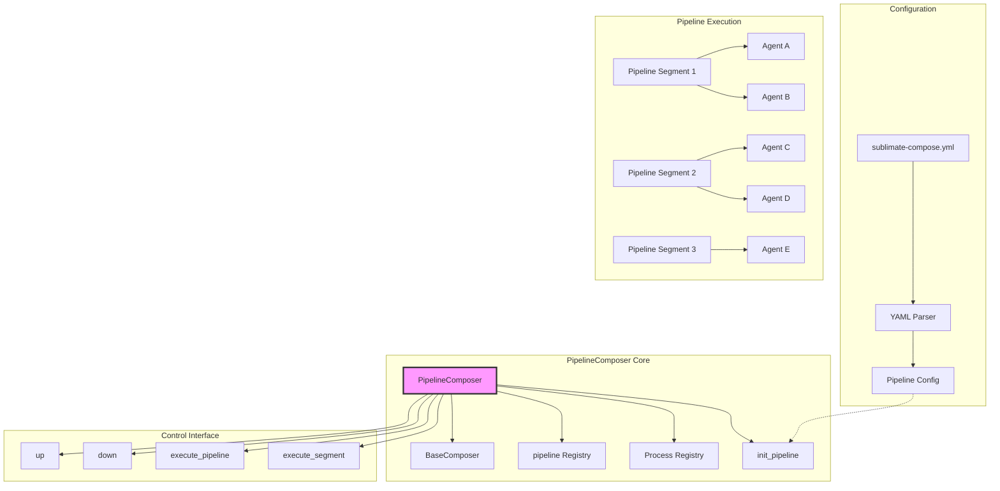
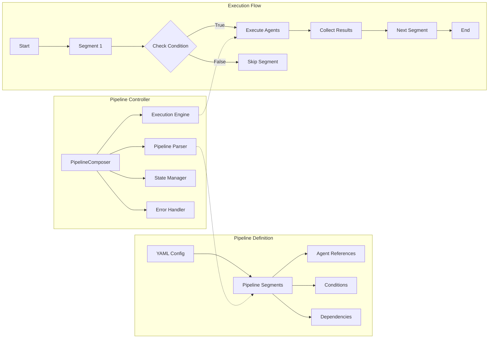

# PipelineComposer Class

## Overview

The `PipelineComposer` class extends `BaseComposer` to provide sequential execution capabilities for AI agents. It enables chaining agents together in defined workflows where each agent's output can serve as input for subsequent agents, creating complex multi-step processes for software development tasks.

**Note**: Currently a stub implementation - pipeline functionality is planned for future releases.

## Architecture Diagram



## Class Definition

```python
class PipelineComposer(BaseComposer):
    def __init__(self, *args, **kwargs):
        super().__init__(*args, **kwargs)
        self.proceses = {}
        self.pipeline = {}
```

## Current Implementation Status

### Current State
The `PipelineComposer` is currently a **stub implementation** with minimal functionality. It provides the foundation for pipeline orchestration but requires significant development to become fully functional.

### Planned Features
1. **Sequential Execution**: Execute agents in defined order
2. **Data Passing**: Pass output from one agent to the next
3. **Conditional Branching**: Support for conditional execution paths
4. **Parallel Execution**: Execute multiple agents in parallel
5. **Error Handling**: Comprehensive error handling and recovery
6. **Monitoring**: Track pipeline execution progress

## Core Responsibilities (Planned)

1. **Pipeline Definition**: Parse and validate pipeline configurations
2. **Sequential Orchestration**: Execute agents in defined order
3. **Data Flow Management**: Manage data passing between agents
4. **Error Propagation**: Handle and propagate errors through pipeline
5. **State Management**: Track pipeline execution state
6. **Result Aggregation**: Combine results from multiple agents

## Inheritance Hierarchy

```
BaseComposer
    ↑
PipelineComposer
```

**Inherited Methods:**
- `init_chat_models()`
- `init_agents()`
- `init()`
- `get_agent()`
- `schedule_agent()`
- All utility methods

**Extended/Overridden Methods:**
- `__init__()` - Adds pipeline-specific attributes
- `init()` - Adds pipeline initialization
- `up()` - Placeholder for pipeline execution
- `down()` - Placeholder for pipeline cleanup

**New Methods:**
- `init_pipeline()` - Initialize pipeline from configuration

## Key Attributes

| Attribute | Type | Description |
|-----------|------|-------------|
| `proceses` | `Dict` | **Note**: Typo in source code - should be `processes`. Placeholder for process tracking |
| `pipeline` | `Dict` | Pipeline configuration and state |
| Inherits all attributes from `BaseComposer` | | |

## Planned Configuration Structure

### YAML Structure
```yaml
models:
  # Model definitions

agents:
  # Agent definitions

pipeline:  # Required section (replaces heartbeats)
  - segment: "analysis"
    agents: ["analyzer"]
    condition: "has_requirements()"

  - segment: "development"
    agents: ["coder", "reviewer"]
    parallel: true
    dependencies: ["analysis"]

  - segment: "testing"
    agents: ["tester"]
    dependencies: ["development"]

  - segment: "deployment"
    agents: ["deployer"]
    condition: "tests_passed()"
    dependencies: ["testing"]
```

### Complete Example (Planned)
```yaml
models:
  default:
    model_provider: ollama
    model: qwen3.5:0.8b

  fast:
    model_provider: ollama
    model: phi3:mini

agents:
  analyzer:
    model: default
    tools: [read_file, analyze_code]
    description: "Analyzes requirements and creates specifications"

  coder:
    model: default
    tools: [write_file, read_file, run_tests]
    description: "Implements features based on specifications"

  reviewer:
    model: fast
    tools: [read_file, create_issue]
    description: "Reviews code for quality and standards"

  tester:
    model: default
    tools: [run_tests, analyze_coverage]
    description: "Runs tests and validates functionality"

  deployer:
    model: fast
    tools: [deploy, rollback]
    description: "Deploys validated code to production"

pipeline:
  - name: "analyze_requirements"
    agents: ["analyzer"]
    input: "./requirements.md"
    output: "./specifications.md"

  - name: "implement_feature"
    agents: ["coder", "reviewer"]
    parallel: true
    dependencies: ["analyze_requirements"]
    input: "./specifications.md"

  - name: "test_implementation"
    agents: ["tester"]
    dependencies: ["implement_feature"]
    timeout: "10m"

  - name: "deploy_to_prod"
    agents: ["deployer"]
    dependencies: ["test_implementation"]
    condition: "all_tests_passed"
    manual_approval: true
```

## Current Methods

### `__init__(*args, **kwargs)`

Initializes the pipeline composer with placeholder attributes.

**Current Implementation:**
```python
def __init__(self, *args, **kwargs):
    super().__init__(*args, **kwargs)
    self.proceses = {}  # Typo: should be processes
    self.pipeline = {}
```

### `init_pipeline()`

Placeholder method for pipeline initialization.

**Current Implementation:**
```python
def init_pipeline(self):
    for segment in self.get_pipeline_from_settings():
        asyncio.gather([
            self.schedule_agent(agent_name) for agent_name in self.get_agent_names()
        ])
    return
```

**Issues with Current Implementation:**
1. Executes all agents for every segment (incorrect)
2. No sequential execution logic
3. No data passing between agents
4. No error handling

### `init()`

Extended initialization that includes pipeline setup.

**Current Implementation:**
```python
def init(self):
    super().init()
    self.init_pipeline()
    return
```

### `up()` and `down()`

Placeholder methods for pipeline control.

**Current Implementation:**
```python
def up(self):
    return

def down(self):
    return
```

## Planned Implementation Details

### Proposed Architecture



### Proposed Method Signatures

```python
class PipelineComposer(BaseComposer):
    def __init__(self, *args, **kwargs):
        super().__init__(*args, **kwargs)
        self.processes = {}  # Fixed typo
        self.pipeline = {}
        self.execution_state = {}
        self.results = {}

    async def execute_pipeline(self, pipeline_name=None):
        """Execute the entire pipeline or a specific named pipeline"""
        pass

    async def execute_segment(self, segment_name):
        """Execute a specific pipeline segment"""
        pass

    async def execute_agent_in_pipeline(self, agent_name, context=None):
        """Execute an agent within pipeline context"""
        pass

    def get_pipeline_status(self):
        """Get current status of all pipelines"""
        pass

    def get_segment_results(self, segment_name):
        """Get results from a specific segment"""
        pass

    def pause_pipeline(self, pipeline_name):
        """Pause a running pipeline"""
        pass

    def resume_pipeline(self, pipeline_name):
        """Resume a paused pipeline"""
        pass

    def cancel_pipeline(self, pipeline_name):
        """Cancel a running pipeline"""
        pass
```

## Usage Examples (Planned)

### Basic Pipeline Execution

```python
from src.orchestration.composer import PipelineComposer
import asyncio

# Initialize composer
composer = PipelineComposer(
    agent_home="./my_agents",
    tools={}  # Define tools as needed
)

# Initialize everything
composer.init()

# Execute pipeline
async def run_pipeline():
    results = await composer.execute_pipeline()
    print(f"Pipeline completed with results: {results}")

    # Check individual segment results
    analysis_results = composer.get_segment_results("analysis")
    print(f"Analysis results: {analysis_results}")

asyncio.run(run_pipeline())
```

### Conditional Pipeline Execution

```python
class ConditionalPipelineComposer(PipelineComposer):
    async def execute_segment(self, segment_name):
        segment = self.pipeline[segment_name]

        # Check condition
        if "condition" in segment:
            condition_func = self._parse_condition(segment["condition"])
            if not condition_func():
                print(f"Skipping segment {segment_name} - condition not met")
                return {"status": "skipped", "reason": "condition_not_met"}

        # Execute segment
        return await super().execute_segment(segment_name)

# Usage
composer = ConditionalPipelineComposer("./agents", {})
composer.init()

# Pipeline with conditions
# Will only execute deployment if tests pass
await composer.execute_pipeline()
```

### Parallel Execution

```python
class ParallelPipelineComposer(PipelineComposer):
    async def execute_segment(self, segment_name):
        segment = self.pipeline[segment_name]

        if segment.get("parallel", False):
            # Execute agents in parallel
            agent_tasks = []
            for agent_name in segment["agents"]:
                task = asyncio.create_task(
                    self.execute_agent_in_pipeline(agent_name, segment.get("context"))
                )
                agent_tasks.append(task)

            # Wait for all agents to complete
            results = await asyncio.gather(*agent_tasks, return_exceptions=True)

            # Process results
            return {
                "status": "completed",
                "parallel": True,
                "results": results
            }
        else:
            # Sequential execution
            return await super().execute_segment(segment_name)

# Usage
composer = ParallelPipelineComposer("./agents", {})
composer.init()

# Pipeline with parallel segments
# coder and reviewer will execute simultaneously
await composer.execute_pipeline()
```

## Error Handling Strategies (Planned)

### Comprehensive Error Handling

```python
class ResilientPipelineComposer(PipelineComposer):
    async def execute_segment(self, segment_name):
        segment = self.pipeline[segment_name]
        max_retries = segment.get("max_retries", 3)

        for attempt in range(max_retries):
            try:
                return await super().execute_segment(segment_name)
            except Exception as e:
                if attempt == max_retries - 1:
                    # Final attempt failed
                    if segment.get("fail_fast", False):
                        raise PipelineError(f"Segment {segment_name} failed after {max_retries} attempts")
                    else:
                        # Continue with next segment
                        return {
                            "status": "failed",
                            "error": str(e),
                            "attempts": attempt + 1
                        }

                # Wait before retry
                retry_delay = segment.get("retry_delay", 60)
                await asyncio.sleep(retry_delay)

        return {"status": "failed", "error": "max_retries_exceeded"}
```

### Graceful Degradation

```python
class GracefulPipelineComposer(PipelineComposer):
    async def execute_segment(self, segment_name):
        segment = self.pipeline[segment_name]
        fallback_agents = segment.get("fallback_agents", [])

        try:
            return await super().execute_segment(segment_name)
        except Exception as e:
            print(f"Segment {segment_name} failed: {e}")

            # Try fallback agents
            if fallback_agents:
                print(f"Trying fallback agents: {fallback_agents}")
                segment["agents"] = fallback_agents
                return await super().execute_segment(segment_name)

            # If no fallback, check if segment is optional
            if segment.get("optional", False):
                return {"status": "skipped", "reason": "optional_failed"}

            raise
```

## Testing Strategies (Planned)

### Unit Tests

```python
import pytest
from unittest.mock import Mock, patch, AsyncMock
import asyncio

@pytest.mark.asyncio
async def test_pipeline_execution():
    """Test basic pipeline execution"""
    composer = PipelineComposer("test_home", {})

    # Mock pipeline configuration
    composer.pipeline = {
        "analysis": {
            "agents": ["analyzer"],
            "dependencies": []
        },
        "development": {
            "agents": ["coder"],
            "dependencies": ["analysis"]
        }
    }

    # Mock agents
    mock_analyzer = AsyncMock()
    mock_analyzer.run.return_value = "Analysis complete"

    mock_coder = AsyncMock()
    mock_coder.run.return_value = "Development complete"

    composer.agents = {
        "analyzer": mock_analyzer,
        "coder": mock_coder
    }

    # Execute pipeline
    results = await composer.execute_pipeline()

    # Verify execution order
    assert mock_analyzer.run.called
    assert mock_coder.run.called

    # Verify dependency order
    analyzer_call_time = mock_analyzer.run.call_args[0][0]
    coder_call_time = mock_coder.run.call_args[0][0]
    assert analyzer_call_time < coder_call_time
```

### Integration Tests

```python
@pytest.mark.asyncio
async def test_complete_pipeline_flow():
    """Test complete pipeline with data passing"""
    with tempfile.TemporaryDirectory() as tmpdir:
        # Create configuration
        config = {
            "models": {"default": {"model_provider": "ollama", "model": "test"}},
            "agents": {
                "writer": {"model": "default", "tools": []},
                "reviewer": {"model": "default", "tools": []}
            },
            "pipeline": [
                {
                    "name": "write_document",
                    "agents": ["writer"],
                    "output": "document.md"
                },
                {
                    "name": "review_document",
                    "agents": ["reviewer"],
                    "dependencies": ["write_document"],
                    "input": "document.md"
                }
            ]
        }

        # Create configuration file
        config_path = os.path.join(tmpdir, "sublimate-compose.yml")
        with open(config_path, 'w') as f:
            yaml.dump(config, f)

        # Create composer
        composer = PipelineComposer(tmpdir, {})
        composer.init()

        # Mock agent execution
        with patch.object(composer.agents["writer"], 'run') as mock_write:
            with patch.object(composer.agents["reviewer"], 'run') as mock_review:
                mock_write.return_value = "# Test Document"
                mock_review.return_value = "Document reviewed"

                # Execute pipeline
                results = await composer.execute_pipeline()

                # Verify data passing
                # Reviewer should receive writer's output
                review_context = mock_review.call_args[0][0]
                assert "Test Document" in str(review_context)
```

## Best Practices (Planned)

### Pipeline Design
1. **Modular Segments**: Design pipeline segments as independent units
2. **Clear Dependencies**: Explicitly define dependencies between segments
3. **Error Boundaries**: Design pipelines to handle failures gracefully
4. **Monitoring Points**: Include monitoring at key pipeline stages

### Configuration Management
1. **Version Control**: Keep pipeline configurations in version control
2. **Environment Variables**: Use environment-specific pipeline configurations
3. **Validation**: Validate pipeline configurations before execution
4. **Documentation**: Document pipeline purposes and expected outcomes

### Performance Optimization
1. **Parallel Execution**: Use parallel execution where possible
2. **Caching**: Cache intermediate results for reuse
3. **Resource Management**: Limit concurrent pipeline executions
4. **Optimization**: Profile and optimize slow pipeline segments

### Security Considerations
1. **Input Validation**: Validate all pipeline inputs
2. **Access Control**: Restrict pipeline execution to authorized users
3. **Audit Logging**: Log all pipeline executions
4. **Data Isolation**: Isolate pipeline data between executions

## Migration Path from Current Implementation

### Phase 1: Foundation
1. Fix typo in `proceses` attribute
2. Implement basic sequential execution
3. Add pipeline configuration parsing
4. Implement `execute_pipeline()` method

### Phase 2: Core Features
1. Implement data passing between agents
2. Add dependency resolution
3. Implement error handling
4. Add pipeline state management

### Phase 3: Advanced Features
1. Implement parallel execution
2. Add conditional execution
3. Implement pipeline monitoring
4. Add pipeline control methods (pause, resume, cancel)

### Phase 4: Production Ready
1. Add comprehensive testing
2. Implement performance optimizations
3. Add security features
4. Create documentation and examples

## Related Documentation

- [BaseComposer Documentation](./BaseComposer.md)
- [HeartbeatComposer Documentation](./HeartbeatComposer.md)
- [WorkerAgent Documentation](./WorkerAgent.md)
- [Composer Overview](../composer.md)

## Summary

The `PipelineComposer` class represents the future direction for sequential agent orchestration in the Sublimate Composer system. While currently a stub implementation, it provides the architectural foundation for complex multi-agent workflows where agents can be chained together with data passing, conditional execution, and error handling. The planned implementation will enable sophisticated software development pipelines that automate complex processes while maintaining reliability and observability.
