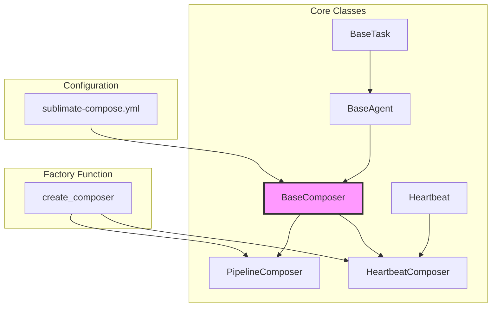

# Composer Module Documentation

## Overview

The Composer module is the core orchestration engine of the Sublimate system, providing a framework for managing AI agents, scheduling their execution, and coordinating complex workflows. This documentation covers all classes and functions in the `src.orchestration/composer.py` module.

## Module Architecture



## Documentation Index

### Core Classes

| Class | Purpose | Status | Documentation |
|-------|---------|--------|---------------|
| **BaseTask** | Foundation for task handling | Minimal implementation | [BaseTask.md](./BaseTask.md) |
| **BaseAgent** | Individual AI agent with tools and context | Complete | [BaseAgent.md](./BaseAgent.md) |
| **BaseComposer** | Core orchestration engine | Complete | [BaseComposer.md](./BaseComposer.md) |
| **Heartbeat** | Scheduled execution using cron | Complete | [Heartbeat.md](./Heartbeat.md) |
| **HeartbeatComposer** | Manages heartbeat-scheduled agents | Complete | [HeartbeatComposer.md](./HeartbeatComposer.md) |
| **PipelineComposer** | Sequential agent workflows | **Stub implementation** | [PipelineComposer.md](./PipelineComposer.md) |

### Factory Function

| Function | Purpose | Documentation |
|----------|---------|---------------|
| **create_composer** | Factory function for composer creation | [create_composer.md](./create_composer.md) |

## Quick Start Guide

### 1. Installation and Setup

```bash
# Clone the repository
git clone <repository-url>
cd paperclip-clone/master

# Install dependencies
pip install -e .

# Create agent directory
mkdir -p my_agents
cp agent_templates/default/* my_agents/
```

### 2. Basic Configuration

Create `my_agents/sublimate-compose.yml`:

```yaml
models:
  default:
    model_provider: ollama
    model: qwen3.5:0.8b

agents:
  coder:
    model: default
    tools: [write_file, read_file]

heartbeats:
  coder:
    schedule: "*/30 * * * *"
```

### 3. Create and Run Composer

```python
from src.orchestration.composer import create_composer

# Define tools
def write_file(path, content):
    with open(path, 'w') as f:
        f.write(content)
    return f"Written to {path}"

def read_file(path):
    with open(path, 'r') as f:
        return f.read()

tools = {
    'write_file': write_file,
    'read_file': read_file
}

# Create composer
composer = create_composer(
    agent_home="./my_agents",
    tools=tools
)

# Initialize and start
composer.init()
composer.up()  # Starts heartbeats
```

## Configuration Reference

### File Structure
```
agent_home/
├── sublimate-compose.yml    # Main configuration
├── {agent_name}.md          # Agent prompts
└── heartbeats/
    └── {agent_name}.md      # Heartbeat instructions
```

### Configuration Sections

| Section | Required | Description |
|---------|----------|-------------|
| `models` | Yes | LLM model configurations |
| `agents` | Yes | Agent definitions with tools |
| `heartbeats` or `pipeline` | Yes | Execution strategy |

## Common Use Cases

### 1. Scheduled Code Review
```yaml
heartbeats:
  code-reviewer:
    schedule: "0 9 * * 1-5"  # Weekdays at 9 AM
```

### 2. Continuous Integration Pipeline
```yaml
pipeline:
  - segment: "test"
    agents: ["tester"]
  - segment: "build"
    agents: ["builder"]
    dependencies: ["test"]
  - segment: "deploy"
    agents: ["deployer"]
    dependencies: ["build"]
```

### 3. Multi-Agent Collaboration
```yaml
agents:
  architect:
    model: default
    tools: [create_design]
  developer:
    model: default
    tools: [write_code]
  reviewer:
    model: default
    tools: [review_code]

heartbeats:
  architect:
    schedule: "0 0 * * *"  # Daily
  developer:
    schedule: "*/15 * * * *"  # Every 15 minutes
    dependencies: [architect]
  reviewer:
    schedule: "0 * * * *"  # Hourly
    dependencies: [developer]
```

## Error Handling Guide

### Common Errors and Solutions

| Error | Cause | Solution |
|-------|-------|----------|
| `FileNotFoundError` | Missing `sublimate-compose.yml` | Create configuration file |
| `KeyError` | Missing required sections | Add `models`, `agents`, and `heartbeats`/`pipeline` |
| `RuntimeError` | Heartbeat already running | Stop before restarting |
| `ValueError` | Invalid cron expression | Validate cron syntax |

### Debugging Tips

```python
import logging
logging.basicConfig(level=logging.DEBUG)

# Check configuration
import yaml
with open("my_agents/sublimate-compose.yml") as f:
    print(yaml.dump(yaml.safe_load(f)))

# Check agent state
agent = composer.get_agent("coder")
print(f"Prompt loaded: {bool(agent.prompt)}")
print(f"Heartbeat loaded: {bool(agent.heartbeat)}")
```

## Performance Optimization

### 1. Reduce Context Size
```python
class OptimizedAgent(BaseAgent):
    def format_message_history(self, message_history, **kwargs):
        # Limit context to essential files
        kwargs['include_context_files'] = False
        return super().format_message_history(message_history, **kwargs)
```

### 2. Implement Caching
```python
class CachedComposer(BaseComposer):
    def __init__(self, *args, **kwargs):
        super().__init__(*args, **kwargs)
        self._model_cache = {}
        self._agent_cache = {}
```

### 3. Use Lazy Loading
```python
class LazyComposer(BaseComposer):
    def get_agent(self, name):
        if not self._initialized:
            self.init()
        return super().get_agent(name)
```

## Security Considerations

### 1. Tool Restrictions
```python
tools = {
    'safe_write': restricted_write_file,  # Only allows specific directories
    'safe_read': restricted_read_file,    # Blocks sensitive files
}
```

### 2. Path Validation
```python
def validate_path(path, allowed_patterns):
    for pattern in allowed_patterns:
        if fnmatch.fnmatch(path, pattern):
            return True
    raise SecurityError(f"Access denied: {path}")
```

### 3. API Key Management
```python
def fetch_api_key_for_provider(provider):
    # Use environment variables or secret manager
    return os.environ.get(f"{provider.upper()}_API_KEY")
```

## Testing Strategy

### Unit Tests
```bash
pytest tests/test_composer.py -v
```

### Integration Tests
```bash
pytest tests/test_composer_integration.py -v
```

### Coverage Report
```bash
pytest tests/test_composer.py --cov=src.orchestration.composer --cov-report=html
```

## Extension Patterns

### Custom Agent Classes
```python
class SpecializedAgent(BaseAgent):
    def __init__(self, *args, specialty=None, **kwargs):
        super().__init__(*args, **kwargs)
        self.specialty = specialty

    def format_message_history(self, message_history, **kwargs):
        formatted = super().format_message_history(message_history, **kwargs)
        if self.specialty:
            formatted["messages"].insert(0, {
                "role": "system",
                "content": f"Specialty: {self.specialty}"
            })
        return formatted
```

### Plugin System
```python
class PluginComposer(BaseComposer):
    def __init__(self, *args, plugins=None, **kwargs):
        super().__init__(*args, **kwargs)
        self.plugins = plugins or []

    def init(self):
        for plugin in self.plugins:
            plugin.pre_init(self)
        super().init()
        for plugin in self.plugins:
            plugin.post_init(self)
```

## Migration Guide

### From Manual to Automated
1. **Phase 1**: Replace manual agent creation with `BaseComposer`
2. **Phase 2**: Implement heartbeat scheduling with `HeartbeatComposer`
3. **Phase 3**: Add pipeline workflows with `PipelineComposer`
4. **Phase 4**: Implement monitoring and error recovery

### Configuration Migration
```python
# Old way
agent = BaseAgent("coder", "./agents", model, tools)

# New way
composer = create_composer(agent_home="./agents", tools=tools)
composer.init()
agent = composer.get_agent("coder")
```

## Related Resources

### External Documentation
- [LangChain Documentation](https://python.langchain.com/docs/)
- [Cron Expression Guide](https://crontab.guru/)
- [YAML Specification](https://yaml.org/spec/)

### Internal Documentation
- [Main Composer Documentation](../composer.md)
- [API Reference](./API_REFERENCE.md) (Planned)
- [Troubleshooting Guide](./TROUBLESHOOTING.md) (Planned)

## Contributing

### Development Workflow
1. Fork the repository
2. Create a feature branch
3. Write tests for new functionality
4. Implement changes
5. Run test suite
6. Submit pull request

### Code Standards
- Follow PEP 8 style guide
- Write comprehensive docstrings
- Include type hints
- Add unit tests for all new code

### Testing Requirements
- Maintain 80%+ test coverage
- Test both success and error cases
- Include integration tests for complex features
- Mock external dependencies

## Support

### Getting Help
- **GitHub Issues**: Report bugs and request features
- **Documentation**: Check this documentation first
- **Community Forum**: Ask questions and share experiences

### Reporting Issues
When reporting issues, include:
1. Configuration file (redacted)
2. Error traceback
3. Steps to reproduce
4. Expected vs actual behavior

## License

[Include appropriate license information]

## Changelog

### Version 1.0.0
- Initial release with BaseComposer and HeartbeatComposer
- Basic agent orchestration and scheduling
- YAML-based configuration

### Planned Features
- Complete PipelineComposer implementation
- Web dashboard for monitoring
- Plugin system for extensibility
- Distributed execution support

---

*Last updated: April 5, 2026*
*Documentation version: 1.0.0*
