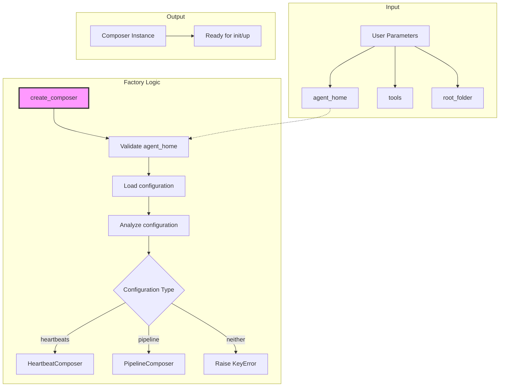

# create_composer Function

## Overview

The `create_composer` function is a factory function that automatically creates the appropriate composer instance (`HeartbeatComposer` or `PipelineComposer`) based on the configuration found in `sublimate-compose.yml`. It simplifies composer initialization by analyzing the configuration file and returning the correct composer type.

## Function Signature

```python
def create_composer(**kwargs):
    agent_home = kwargs.get("agent_home")
    if not agent_home:
        raise ValueError("No agent_home set.")
    
    # Configuration analysis and composer creation logic
```

## Architecture Diagram



## Core Responsibilities

1. **Configuration Detection**: Analyze `sublimate-compose.yml` to determine composer type
2. **Factory Creation**: Instantiate the appropriate composer class
3. **Error Handling**: Validate inputs and configuration structure
4. **Simplified Interface**: Provide a single entry point for composer creation

## Parameters

| Parameter | Type | Required | Description |
|-----------|------|----------|-------------|
| `agent_home` | `str` or `Path` | Yes | Directory containing `sublimate-compose.yml` |
| `tools` | `Dict[str, Callable]` | No | Dictionary of tools for agents (default: `{}`) |
| `root_folder` | `str` | No | Root directory for project context (default: `""`) |
| Additional kwargs | Any | No | Passed to composer constructor |

## Return Value

Returns an instance of either:
- `HeartbeatComposer` if configuration contains `heartbeats` section
- `PipelineComposer` if configuration contains `pipeline` section

## Decision Logic

```python
if data.get("heartbeats"):
    return HeartbeatComposer(**kwargs)
elif data.get("pipeline"):
    return PipelineComposer(**kwargs)
else:
    return KeyError("You need either a `heartbeats` or a `pipeline` in your sublimate-compose.yml if you want to create a composer!")
```

## Usage Examples

### Basic Usage

```python
from src.composer.composer import create_composer

# Define tools
tools = {
    'write_file': lambda path, content: f"Written to {path}",
    'read_file': lambda path: f"Content of {path}"
}

# Create composer automatically based on configuration
composer = create_composer(
    agent_home="./my_agents",
    tools=tools,
    root_folder="/projects/my_project"
)

# Initialize and use the composer
composer.init()
composer.up()  # Will work for HeartbeatComposer
```

### With Different Configuration Types

**Configuration 1: Heartbeats (sublimate-compose.yml)**
```yaml
models:
  default:
    model_provider: ollama
    model: qwen3.5:0.8b

agents:
  coder:
    model: default
    tools: [write_file]

heartbeats:  # This triggers HeartbeatComposer
  coder:
    schedule: "*/30 * * * *"
```

**Configuration 2: Pipeline (sublimate-compose.yml)**
```yaml
models:
  default:
    model_provider: ollama
    model: qwen3.5:0.8b

agents:
  analyzer:
    model: default
    tools: [read_file]
  coder:
    model: default
    tools: [write_file]

pipeline:  # This triggers PipelineComposer
  - segment: "analysis"
    agents: ["analyzer"]
  - segment: "development"
    agents: ["coder"]
    dependencies: ["analysis"]
```

**Python code works the same for both:**
```python
composer = create_composer(agent_home="./agents", tools={})
# Returns HeartbeatComposer for config 1
# Returns PipelineComposer for config 2
```

### Error Handling

```python
from src.composer.composer import create_composer
import tempfile
import os

# Test missing agent_home
try:
    composer = create_composer()  # Missing agent_home
except ValueError as e:
    print(f"Expected error: {e}")  # "No agent_home set."

# Test missing configuration file
try:
    with tempfile.TemporaryDirectory() as tmpdir:
        composer = create_composer(agent_home=tmpdir)
except FileNotFoundError as e:
    print(f"Expected error: {e}")  # "sublimate-compose.yml not found!"

# Test invalid configuration
try:
    with tempfile.TemporaryDirectory() as tmpdir:
        config_path = os.path.join(tmpdir, "sublimate-compose.yml")
        with open(config_path, 'w') as f:
            f.write("agents: {}")  # Missing both heartbeats and pipeline
        
        composer = create_composer(agent_home=tmpdir)
except KeyError as e:
    print(f"Expected error: {e}")  # "You need either a `heartbeats` or a `pipeline`..."
```

## Implementation Details

### Source Code

```python
def create_composer(**kwargs):
    agent_home = kwargs.get("agent_home")
    if not agent_home:
        raise ValueError("No agent_home set.")

    agent_home = (
        isinstance(agent_home, Path) and agent_home or Path(agent_home)
    )

    filepath = agent_home / "sublimate-compose.yml"
    if os.path.exists(filepath):
        with open(filepath) as f:
            data = yaml.safe_load(f)
        if data.get("heartbeats"):
            return HeartbeatComposer(**kwargs)
        elif data.get("pipeline"):
            return PipelineComposer(**kwargs)
        else:
            return KeyError("You need either a `heartbeats` or a `pipeline` in your sublimate-compose.yml if you want to create a composer!")
    else:
        raise FileNotFoundError(
            f"{filepath} not found! You need a sublimate-compose.yml if you want to use compose."
        )
```

### Step-by-Step Execution

1. **Validate `agent_home` parameter**
   - Check if `agent_home` is provided
   - Convert to `Path` object if necessary

2. **Check configuration file existence**
   - Construct path to `sublimate-compose.yml`
   - Verify file exists

3. **Load and parse configuration**
   - Read YAML file
   - Parse with `yaml.safe_load()`

4. **Determine composer type**
   - Check for `heartbeats` key → `HeartbeatComposer`
   - Check for `pipeline` key → `PipelineComposer`
   - Neither → Raise `KeyError`

5. **Instantiate appropriate composer**
   - Pass all kwargs to composer constructor
   - Return composer instance

## Error Handling Scenarios

### Missing agent_home
```python
try:
    composer = create_composer()
except ValueError as e:
    # Handle missing agent_home
    print(f"Error: {e}")
    # Prompt user for agent_home or use default
```

### Missing Configuration File
```python
try:
    composer = create_composer(agent_home="./nonexistent")
except FileNotFoundError as e:
    # Handle missing configuration
    print(f"Error: {e}")
    # Create default configuration or prompt user
```

### Invalid Configuration Structure
```python
try:
    composer = create_composer(agent_home="./invalid_config")
except KeyError as e:
    # Handle invalid configuration
    print(f"Error: {e}")
    # Validate and fix configuration
```

### YAML Parsing Errors
```python
try:
    composer = create_composer(agent_home="./malformed_yaml")
except yaml.YAMLError as e:
    # Handle YAML parsing errors
    print(f"YAML Error: {e}")
    # Provide helpful error message
```

## Extension Patterns

### Custom Composer Factory

```python
def create_custom_composer(**kwargs):
    """Extended factory with additional validation and customization"""
    
    # Validate agent_home
    agent_home = kwargs.get("agent_home")
    if not agent_home:
        raise ValueError("No agent_home set.")
    
    # Convert to Path
    agent_home = Path(agent_home)
    
    # Check if directory exists
    if not agent_home.exists():
        raise FileNotFoundError(f"Directory {agent_home} does not exist")
    
    # Check configuration file
    config_path = agent_home / "sublimate-compose.yml"
    if not config_path.exists():
        # Create default configuration
        create_default_configuration(agent_home)
    
    # Load configuration
    with open(config_path) as f:
        data = yaml.safe_load(f)
    
    # Additional validation
    validate_configuration(data)
    
    # Determine composer type with fallback
    if data.get("heartbeats"):
        composer_class = HeartbeatComposer
    elif data.get("pipeline"):
        composer_class = PipelineComposer
    else:
        # Default to HeartbeatComposer with warning
        print("Warning: No heartbeats or pipeline found, using HeartbeatComposer with default schedule")
        data["heartbeats"] = create_default_heartbeats(data.get("agents", {}))
        composer_class = HeartbeatComposer
    
    # Create composer
    return composer_class(**kwargs)
```

### Environment-Specific Factory

```python
def create_environment_composer(environment="development", **kwargs):
    """Create composer with environment-specific configuration"""
    
    agent_home = kwargs.get("agent_home")
    if not agent_home:
        raise ValueError("No agent_home set.")
    
    agent_home = Path(agent_home)
    
    # Look for environment-specific configuration
    env_config_path = agent_home / f"sublimate-compose.{environment}.yml"
    default_config_path = agent_home / "sublimate-compose.yml"
    
    config_path = env_config_path if env_config_path.exists() else default_config_path
    
    if not config_path.exists():
        raise FileNotFoundError(f"No configuration found at {config_path}")
    
    # Load configuration
    with open(config_path) as f:
        data = yaml.safe_load(f)
    
    # Apply environment-specific overrides
    data = apply_environment_overrides(data, environment)
    
    # Determine composer type
    if data.get("heartbeats"):
        return HeartbeatComposer(**kwargs)
    elif data.get("pipeline"):
        return PipelineComposer(**kwargs)
    else:
        raise KeyError("Configuration must specify heartbeats or pipeline")
```

## Testing Strategies

### Unit Tests

```python
import pytest
from unittest.mock import Mock, patch, mock_open
import tempfile
import os
import yaml

def test_create_composer_missing_agent_home():
    """Test error when agent_home is missing"""
    with pytest.raises(ValueError, match="No agent_home set."):
        create_composer()

def test_create_composer_file_not_found():
    """Test error when configuration file is missing"""
    with tempfile.TemporaryDirectory() as tmpdir:
        with pytest.raises(FileNotFoundError, match="sublimate-compose.yml not found"):
            create_composer(agent_home=tmpdir)

def test_create_composer_heartbeats():
    """Test creation of HeartbeatComposer"""
    config_data = {
        "models": {"default": {"model_provider": "ollama", "model": "test"}},
        "agents": {"test": {"model": "default"}},
        "heartbeats": {"test": {"schedule": "* * * * *"}}
    }
    
    with tempfile.TemporaryDirectory() as tmpdir:
        config_path = os.path.join(tmpdir, "sublimate-compose.yml")
        with open(config_path, 'w') as f:
            yaml.dump(config_data, f)
        
        composer = create_composer(agent_home=tmpdir)
        assert isinstance(composer, HeartbeatComposer)

def test_create_composer_pipeline():
    """Test creation of PipelineComposer"""
    config_data = {
        "models": {"default": {"model_provider": "ollama", "model": "test"}},
        "agents": {"test": {"model": "default"}},
        "pipeline": [{"segment": "test", "agents": ["test"]}]
    }
    
    with tempfile.TemporaryDirectory() as tmpdir:
        config_path = os.path.join(tmpdir, "sublimate-compose.yml")
        with open(config_path, 'w') as f:
            yaml.dump(config_data, f)
        
        composer = create_composer(agent_home=tmpdir)
        assert isinstance(composer, PipelineComposer)

def test_create_composer_invalid_config():
    """Test error when configuration has neither heartbeats nor pipeline"""
    config_data = {
        "models": {"default": {"model_provider": "ollama", "model": "test"}},
        "agents": {"test": {"model": "default"}}
        # Missing heartbeats and pipeline
    }
    
    with tempfile.TemporaryDirectory() as tmpdir:
        config_path = os.path.join(tmpdir, "sublimate-compose.yml")
        with open(config_path, 'w') as f:
            yaml.dump(config_data, f)
        
        with pytest.raises(KeyError, match="heartbeats or a pipeline"):
            create_composer(agent_home=tmpdir)
```

### Integration Tests

```python
@pytest.mark.asyncio
async def test_create_composer_with_tools():
    """Test composer creation with tool integration"""
    config_data = {
        "models": {"default": {"model_provider": "ollama", "model": "test"}},
        "agents": {
            "coder": {"model": "default", "tools": ["write_file"]}
        },
        "heartbeats": {
            "coder": {"schedule": "* * * * *"}
        }
    }
    
    tools = {
        "write_file": Mock(return_value="File written")
    }
    
    with tempfile.TemporaryDirectory() as tmpdir:
        config_path = os.path.join(tmpdir, "sublimate-compose.yml")
        with open(config_path, 'w') as f:
            yaml.dump(config_data, f)
        
        # Create agent files
        agent_dir = os.path.join(tmpdir, "agents")
        os.makedirs(agent_dir)
        os.makedirs(os.path.join(agent_dir, "heartbeats"))
        
        with open(os.path.join(agent_dir, "coder.md"), 'w') as f:
            f.write("# Coder Agent")
        
        with open(os.path.join(agent_dir, "heartbeats", "coder.md"), 'w') as f:
            f.write("# Coder Heartbeat")
        
        # Mock model initialization
        with patch("langchain.chat_models.init_chat_model") as mock_model:
            mock_model_instance = Mock()
            mock_model.return_value = mock_model_instance
            
            # Create composer
            composer = create_composer(agent_home=agent_dir, tools=tools)
            
            assert isinstance(composer, HeartbeatComposer)
            composer.init()
            
            # Verify tools were passed to agent
            agent = composer.get_agent("coder")
            assert len(agent.tools) == 1
            assert agent.tools[0] == tools["write_file"]
```

## Best Practices

### Configuration Management
1. **Clear Naming**: Use descriptive names for configuration files
2. **Version Control**: Keep configurations under version control
3. **Environment Separation**: Maintain separate configurations for different environments
4. **Validation**: Validate configurations before deployment

### Error Handling
1. **User-Friendly Messages**: Provide clear error messages
2. **Recovery Options**: Suggest fixes for common errors
3. **Logging**: Log configuration loading and validation
4. **Fallbacks**: Consider default configurations when appropriate

### Performance
1. **Caching**: Cache parsed configurations when possible
2. **Lazy Loading**: Load configurations only when needed
3. **Validation Efficiency**: Optimize configuration validation
4. **Memory Management**: Clean up configuration data after use

### Security
1. **Path Validation**: Validate all file paths in configuration
2. **Input Sanitization**: Sanitize configuration data
3. **Access Control**: Restrict configuration file access
4. **Audit Logging**: Log configuration loading events

## Common Patterns

### Dynamic Configuration Loading

```python
def create_dynamic_composer(config_source=None, **kwargs):
    """Create composer from various configuration sources"""
    
    if config_source is None:
        # Default: file in agent_home
        return create_composer(**kwargs)
    
    elif isinstance(config_source, dict):
        # From dictionary
        return create_composer_from_dict(config_source, **kwargs)
    
    elif isinstance(config_source, str) and config_source.startswith("http"):
        # From URL
        return create_composer_from_url(config_source, **kwargs)
    
    else:
        raise ValueError(f"Unsupported config_source: {config_source}")

def create_composer_from_dict(config_dict, **kwargs):
    """Create composer from configuration dictionary"""
    # Write dict to temp file
    with tempfile.NamedTemporaryFile(mode='w', suffix='.yml', delete=False) as f:
        yaml.dump(config_dict, f)
        temp_path = f.name
    
    try:
        # Use temp file with create_composer
        kwargs['agent_home'] = os.path.dirname(temp_path)
        return create_composer(**kwargs)
    finally:
        # Clean up temp file
        os.unlink(temp_path)
```

### Configuration Templating

```python
def create_templated_composer(template_vars=None, **kwargs):
    """Create composer with template variable substitution"""
    
    agent_home = kwargs.get("agent_home")
    if not agent_home:
        raise ValueError("No agent_home set.")
    
    agent_home = Path(agent_home)
    config_path = agent_home / "sublimate-compose.yml"
    
    if not config_path.exists():
        raise FileNotFoundError(f"Configuration not found at {config_path}")
    
    # Load and template configuration
    with open(config_path) as f:
        template = f.read()
    
    # Apply template variables
    template_vars = template_vars or {}
    for key, value in template_vars.items():
        placeholder = f"{{{{ {key} }}}}"
        template = template.replace(placeholder, str(value))
    
    # Parse templated configuration
    data = yaml.safe_load(template)
    
    # Determine composer type
    if data.get("heartbeats"):
        return HeartbeatComposer(**kwargs)
    elif data.get("pipeline"):
        return PipelineComposer(**kwargs)
    else:
        raise KeyError("Configuration must specify heartbeats or pipeline")
```

## Related Documentation

- [BaseComposer Documentation](./BaseComposer.md)
- [HeartbeatComposer Documentation](./HeartbeatComposer.md)
- [PipelineComposer Documentation](./PipelineComposer.md)
- [Composer Overview](../composer.md)

## Summary

The `create_composer` function provides a convenient factory interface for creating composer instances based on configuration analysis. By automatically detecting whether to use `HeartbeatComposer` or `PipelineComposer`, it simplifies the initialization process and ensures the correct composer type is used for the given configuration. The function includes comprehensive error handling and validation, making it suitable for production use while maintaining flexibility for different deployment scenarios.